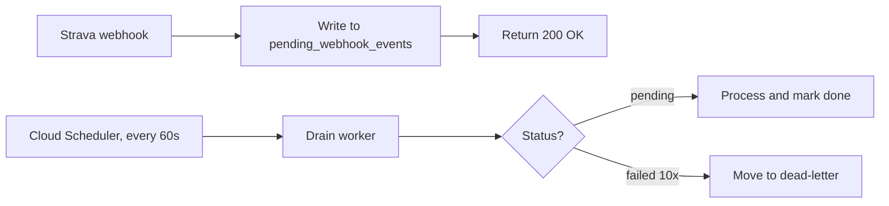

Two paddlers vanished from the leaderboard. Not deleted, just frozen in place. Their weekend SUP sessions had shown up in Strava on Saturday, the app said it got the webhooks fine, and then on Tuesday the weekly standings still hadn't moved. A couple of users had noticed.

I opened the logs expecting a crash or a 500 somewhere. What I found was the opposite. The handler had received the webhook, processed it, returned 200, and left no trace of what happened to the activity after that. The pipeline looked healthy. The leaderboard was just lying.

The actual root cause was one bug and the fix was two lines. What came after the fix was the bigger architecture change I should have made from the start.

## What was actually stuck

The webhook pipeline for paddle activities runs roughly like this. Strava fires a webhook when someone logs an activity, the handler receives it, hands the event through a few internal services, and the leaderboard eventually updates. When everything's healthy the whole thing takes a few seconds.

The stuck activities were hitting `ALREADY_EXISTS` when the handler tried to write them to Firestore. Usually that means a retry: Strava sometimes sends the same webhook twice, and the code is supposed to detect that and skip it. But these weren't retries. These were new activities that had never been successfully processed end-to-end.

The bug was in how the duplicate-detection logic was reading state. A webhook arriving for an activity that had previously *attempted* processing (even unsuccessfully) would see a partial record in the database, conclude it had already been handled, and drop the event on the floor. Nothing logged, no retry, no surfaced error. The event was just gone.

The hotfix was simple enough. Instead of skipping when a record exists, check the activity's actual service states. If anything is still marked pending, republish the event to the processing queue. The real change came down to two lines plus a handful of tests, and it went out the same afternoon. The two stuck activities were replayed manually and showed up on the leaderboard within minutes.

{/*  */}

That patched the immediate bug. But this was the second time in a few months I'd shipped a one-off fix for a stuck webhook (the first one was a Pub/Sub timeout). The pattern in those incidents was that any failure in the synchronous processing chain (a Firestore flake, a downstream service being slow, a bad deploy) could silently lose events. Strava might retry some of them on its own schedule, but not all, and not on a timeline I controlled.

## What the outbox pattern actually does

The outbox pattern is an old idea with a simple premise. Instead of processing an incoming event immediately, write a record of it to your own database first, then process it from there. Your database becomes the guarantee. You stop relying on the event source's retry behavior.

*The drain worker handles retries internally so the webhook handler doesn't have to.*

The drain worker runs every minute. It claims a batch of pending events, processes them, marks them complete. Events that fail get retried with exponential backoff (10 attempts, starting at 30 seconds, capping at an hour). Anything that exhausts all retries moves to a `failed_webhook_events` collection where I can inspect it without losing the data.

The "claim" step uses a 5-minute Firestore transaction so concurrent worker instances don't double-process the same events. This is roughly what message queues do internally, just hand-rolled in Firestore. If a worker crashes mid-batch, the lease expires and the next run picks the events back up.

Before building any of this I went through the design doc carefully, specifically looking for the failure modes. The main one I worried about was duplicate processing. If the drain worker retries an event that had actually succeeded (say, because a network timeout made success look like a failure), would the downstream services handle the duplicate cleanly? The answer was yes for most of them, but it surfaced a few places where idempotency checks needed tightening. Better to find that during design review than in production.

## Running both systems at once

Replacing synchronous webhook processing with an async drain worker is not a change you want to make in one deploy. If the drain worker has a bug, you want to be able to roll back without losing the events that came in during the switchover.

The approach was a feature flag, `OUTBOX_PROCESSING_MODE`, set to either `legacy` or `outbox`. The first deploy went out on `legacy`, which meant the outbox was writing receipts to Firestore on every incoming webhook but the old inline processing was still doing all the real work. Two paths in parallel, with shadow data accumulating in the outbox.

| Mode | Outbox writes | Inline processing |
|---|---|---|
| `legacy` | yes (shadow) | yes (active) |
| `outbox` | yes (active) | no |

After a week of shadow data with no anomalies (receipts written correctly, event counts matched what Strava was sending) I deployed the drain worker, confirmed it was draining cleanly, and switched the flag. The inline retry logic was removed in a separate PR once the outbox had been running for a few days.

## Knowing when it breaks

The thing I kept thinking about during the incident was that I had no idea this was happening. The leaderboard sitting stale for a day before anyone noticed is a long time. If the outbox drain worker silently stops processing, I want to know in minutes, not the next morning.

Two Cloud Monitoring metrics ended up doing the work: oldest pending event age, and failed event count. Both pipe into `#paddle-games-alerts` in Slack. The alert fires when any event is older than 5 minutes in the queue, or when anything lands in the dead-letter collection.

"Are we gonna be notified of these after we add the alerts?" was the explicit question I wanted to be able to answer yes to before considering this done. A webhook reliability system that doesn't tell you when it's not working isn't really a solution.

{/*  */}

## The part that took the longest

The lease logic, and verifying it. Conceptually it's simple. Claim a batch of events, stamp an expiry, process, release. In practice, getting the concurrent claim race right took a few iterations. Two drain workers starting at roughly the same time would both query for `status == 'pending'` before either had written a claim. The fix was a Firestore transaction that makes the read-and-claim atomic.

The test I kept rewriting was the concurrent claim test. The first version ran two claim calls sequentially and called it a race condition test, which it wasn't. The second version used actual parallel promises with a mocked Firestore delay to surface the race, and that one caught a real bug in my initial implementation.

## Where it stands

`OUTBOX_PROCESSING_MODE` is on `outbox` in production and it's been running for a few days. The oldest-pending metric has stayed flat the whole time, nothing has landed in the dead-letter collection, and Slack has been quiet.

The two activities from the original incident were replayed manually. Both users are back on the board. One of them paddled again this week and the activity showed up on the leaderboard right away, which was a good sign.

The next thing I want to tackle is making the replay workflow less manual. Right now if something does end up in dead-letter, recovering it involves running a script. That's fine for now, but a small admin UI for replaying failed events would be useful once this is running at a larger scale.

## The honest takeaway

The outbox pattern is the standard answer to "how do I make event processing reliable", and there's a reason it's the standard answer. Writing the event to your own database before processing it, and owning the retry yourself, gets rid of a whole class of problems.

What I should have done differently was build it first, before shipping any webhook handler. The shadow-mode rollout and the feature flag were both necessary because I was retrofitting the outbox onto existing synchronous code. Starting from the outbox would have been simpler. The operational cost of the cutover is a tax on the original decision.

I don't think every webhook handler needs an outbox on day one. A toy project absolutely doesn't. But once you've shipped a couple of one-off fixes for stuck events, the operational tax of not having one is already higher than the cost of building it.

---

*Built on Node.js, Firestore, Cloud Scheduler, and GCP Cloud Monitoring. Source on [GitHub](https://github.com/pdimeglio-dev/paddle-games).*
