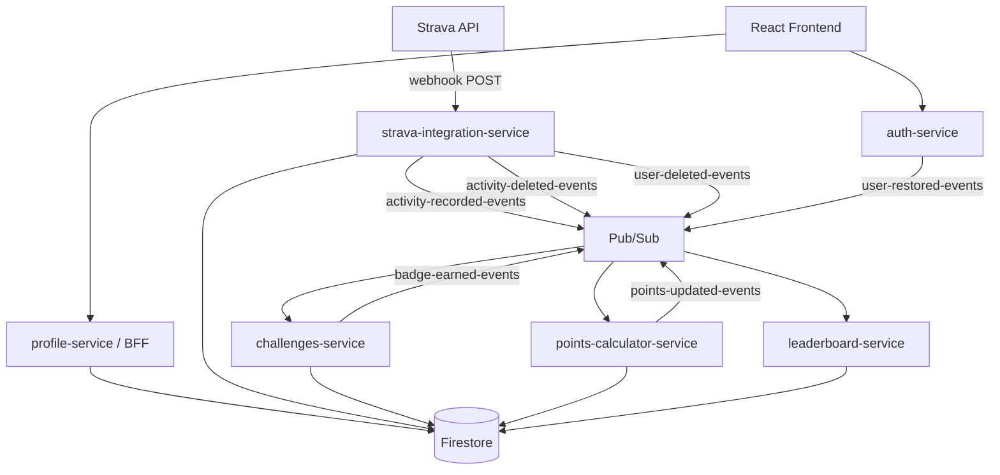

I'm a SUP racer. I paddle competitively out of Redwood City, mostly on the Bay. And like most people who race, I wanted to know where I stand compared to the people I train and race against. Strava is great for logging activities but it doesn't really care about paddle sports specifically. There's no concept of a paddling season, no leaderboard for your local water body, no badges for completing a specific route on the Bay.

So I started building it. The Paddle Games is a competitive tracking platform for paddle sports athletes. Connect your Strava account and your activities flow in automatically. Points accumulate, leaderboards update, and you can earn badges for things like your first 10K paddle or for physically navigating a specific GPS-defined route on the water.

It's been running in production for a few months. This post is an overview of what I built and how it works.

## What the platform actually does

The core loop is pretty simple: you record a paddle on Strava, Strava fires a webhook, and within a minute or two your points update, your leaderboard rank shifts, and any newly earned badges appear on your profile.

The platform covers all the major paddle sport types: Stand Up Paddleboarding, Kayaking, Canoeing, Rowing, and Surfing. Scoring rules filter by `sport_type`, so a user who does both cycling and paddling only sees paddle activities reflected in their points and rank. Everything from Strava comes in unconditionally, and the filtering happens downstream.

Challenges and badges go beyond just activity stats. There's a whole spatial challenge layer where you can earn badges for visiting specific GPS-defined landmarks or completing named routes. The initial content is focused on the San Francisco Bay Area (Richardson Bay, San Pablo Bay, Half Moon Bay, a bunch of waterways paddlers actually use) but the architecture was deliberately designed so that adding a new region is a data problem, not a code problem.

## The architecture

Six independently-deployed Google Cloud Functions services communicate through Pub/Sub. No synchronous service-to-service HTTP calls in the main pipeline. Each service owns its own Firestore collections and reacts to events it cares about.

*How an activity flows from Strava to the leaderboard.*

The frontend talks to `profile-service` only (plus `auth-service` for token refresh). `profile-service` is a stateless BFF that aggregates data from all the other services' Firestore collections into whatever shape the frontend needs. The browser never makes calls to multiple service URLs.

Here's the full fan-out when an activity arrives:

1. Strava fires a minimal webhook (activityId only)
2. `strava-integration-service` writes a durable receipt to `pending_webhook_events` (the outbox), returns 200 to Strava immediately
3. A Cloud Scheduler job hits `/outbox/drain` every minute to process pending events
4. The drain worker fetches the full activity from Strava, stores it in Firestore, and publishes `activity-recorded-events`
5. `challenges-service` and `points-calculator-service` receive the event in parallel
6. `challenges-service` runs up to 9 evaluators, awards badges, publishes `badge-earned-events` if a badge has points
7. `points-calculator-service` applies scoring rules, writes to `user_points_log` and `user_total_scores`, publishes `points-updated-events`
8. `leaderboard-service` receives `points-updated-events` and updates affected leaderboard collections

The outbox was a recent addition after two activities got silently dropped by the original fire-and-forget webhook handler. More on that incident in a dedicated post coming soon.

## Why these tech choices

The whole backend is on GCP because that's what I know well and Cloud Functions Gen2 with a Firestore backend is genuinely fast to iterate on. No cluster to manage, no VMs to patch.

Pub/Sub for the event bus was the obvious choice given the GCP commitment. The event-driven design also fell out pretty naturally from the problem shape: activity ingestion, scoring, challenge evaluation, and leaderboard updates are logically independent and the failure domains are different. A transient Pub/Sub blip shouldn't blow up the whole pipeline.

Firestore for storage was partly familiarity, partly the real-time update capabilities (nice for leaderboards), and partly that the data model fits document storage reasonably well. The one tradeoff I accepted early is that Firestore doesn't give you cross-collection transactions easily, so idempotency is enforced per-service with deterministic document IDs and atomic `create()` calls rather than two-phase commits.

The frontend is React 19 with TanStack Router and TanStack Query. Routing is file-based. shadcn/ui for components. Mapbox GL JS handles the spatial challenge visualization because I needed real map rendering for the admin tool where you draw landmarks and routes.

## What's shipped

The full challenge evaluation system is running. Nine evaluator types cover a pretty wide range of challenge shapes:

| Evaluator | What it does |
|---|---|
| `first_activity` | Badge on your very first recorded paddle |
| `single_activity` | Badge when one session meets stat conditions (distance, duration, sport type) |
| `landmark_visit` | GPS track intersects a defined point asset |
| `scavenger_hunt` | Visit a sequence of landmarks in order, in one session |
| `route_completion` | Cover an entire named line asset in one session |
| `cumulative_route` | Accumulate route coverage across multiple sessions over time |
| `unique_discovery` | Visit N distinct landmarks across any sessions |
| `habit` | Complete a challenge N times within a time window |
| `streak` | Paddle consistently across consecutive weeks |

Points use a data-driven rules engine. Rules live in Firestore and are evaluated against each activity at runtime. A rule can be `FIXED_POINTS` (flat bonus when conditions match) or `POINTS_PER_UNIT` (points per kilometer, per minute, etc.). Conditions filter on any activity field, including computed ones like `distance_km`, `duration_minutes`, `hour` (local time of day), and `isWeekend`. So you can do things like "50 bonus points for any paddle that starts before 8am" without a code change.

Leaderboards support multiple timeframes (all-time, monthly) and are materialized in Firestore with persistent rank fields, so reads are fast and don't require re-calculating rankings on every request. Monthly leaderboards are created automatically by a Cloud Scheduler job at the start of each month.

The spatial content is seeded for the Bay Area. Landmarks and routes are drawn via an admin tool built in Mapbox GL JS, stored as `spatial_assets` in Firestore, and evaluated against Strava's `summary_polyline` using Turf.js for the geospatial calculations. Adding a new region is creating new assets through the admin tool. No code changes.

## What's being worked on now

The most recent work has been on reliability. The original webhook handler was fire-and-forget: Strava sends a webhook, the handler tried to process it synchronously, and if anything went wrong (transient Pub/Sub unavailability, Strava token expiry during fetch, a Cloud Run instance restart mid-request) the activity was gone.

Two real users had activities stuck in a `PENDING` state permanently. The fix was an outbox pattern: the webhook handler now does only one thing on the critical path (a single Firestore `create()` to `pending_webhook_events`), returns 200 to Strava, and a drain worker handles the actual processing asynchronously. Failures become retries with exponential backoff instead of silent drops.

The drain worker has lease-based concurrency control so two Cloud Scheduler invocations running concurrently don't double-process the same event. Deterministic document IDs on the outbox collection mean Strava's aggressive webhook re-delivery doesn't cause duplicate processing either.

Observability came with the reliability work: there's now a Cloud Monitoring metric for oldest pending event age and an alert policy that fires if the queue starts backing up. Before that I was flying blind.

## The honest part

The hardest thing about building this isn't the code. It's the content. Spatial challenges are only as interesting as the landmarks and routes you've seeded for a region. Right now the Bay Area content is sparse. A platform built for paddle sports athletes only comes alive when the challenges are places that athletes actually care about, and building that catalog takes time and local knowledge.

The app is live at [thepaddlegames.com](https://www.thepaddlegames.com/). If you paddle and you're in the Bay Area (or anywhere, eventually), the platform is at the stage where it works correctly and reliably, the leaderboards are live, and the challenge content is actively growing. Updates on [@the.paddle.games](https://www.instagram.com/the.paddle.games/) on Instagram.

What's next is richer challenge content, performance analytics beyond raw points, a notifications system to surface badge earns and leaderboard shifts without having to browse to the URL, and a mobile app for people who'd rather not live in a browser.

---

*Built with React 19, GCP Cloud Functions, Firestore, Pub/Sub, Turf.js, and the Strava API. Source on [GitHub](https://github.com/pdimeglio-dev/paddle-games).*
