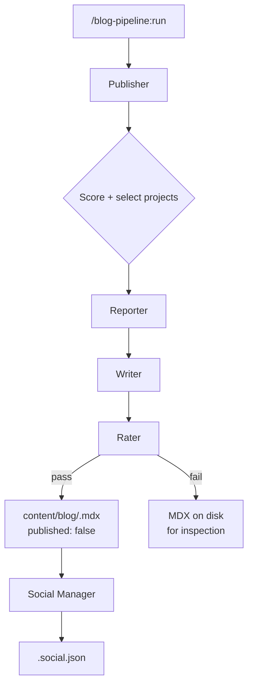

I don't write blog posts consistently. I have a few drafts that never got finished, a note app full of post ideas that went stale, and a general tendency to spend three hours on a Saturday building something and zero minutes writing about it. The work happens. The documentation doesn't.

That's a problem if you're trying to demonstrate that you're shipping things. A portfolio site full of projects with no visible commentary isn't much better than a resume. So earlier this month I started building a pipeline to automate the part I'm bad at: turning work I've already done into posts I'll actually read back.

The result is the Blog Pipeline Plugin. It's a Claude Code plugin that runs as a slash command, reads my local git history across multiple projects, drafts MDX blog posts, generates DALL-E 3 cover images, scores the drafts against my own voice rules, and drops the results into my dimeglio.dev repo with `published: false`. I flip one flag and run `npm run ingest`. That's the entire manual step.

{/*  */}

## What the plugin actually does

It's five agents, run sequentially per project. The Publisher orchestrates the whole thing when I type `/blog-pipeline:run`. Each other agent is stateless and does exactly one job.



*The full pipeline. Reporter, Writer, and Rater each run as a subagent so their contexts stay clean.*

**Reporter** reads `git log --since` on a local repo path, discovers and reads all markdown files in the repo (not just the README), and extracts recent Claude Code session transcripts from `~/.claude/projects/`. That last part matters: commit messages record what changed; session transcripts record why. The output is structured JSON that the Writer uses as raw material.

**Writer** takes that JSON, reads my voice rules fresh from `dimeglio.dev/AGENTS.md`, drafts a full MDX post (1200-2000 words, target ~1600), and calls DALL-E 3 for a cover image. For the first post on any project, it writes an architectural intro instead of a feature post.

**Rater** runs a deterministic regex pre-check before any LLM scoring. Em-dashes anywhere in the body are an automatic fail. So are banned buzzwords (the ones that scream AI-generated text), title formulas like "How X Led to Y", and the prose pattern I kept seeing in early drafts ("Not a crash, not a 500, just a leaderboard that hadn't moved"). If the regex passes, the Rater scores on three axes: substance (40%), showcase value (40%), writing quality (20%). Composite threshold to pass is 6.5.

**Publisher** owns `editorial_state.json` in the dimeglio.dev repo. It scores each project using priority, days since last post, cooldown windows, and monthly caps, then selects the top 1-2 for the current run. First post per project triggers intro mode automatically.

**Social Manager** is the fifth agent, invoked manually after I review a draft. It generates LinkedIn copy (150-250 words) and an X post or thread, presents them for feedback, and saves `<slug>.social.json` next to the MDX only when I approve.

## Why a Claude Code plugin and not something else

The obvious alternative was a standalone Node.js script or a GitHub Action. I have both of those patterns already working for other things, and I didn't use them here on purpose.

The agents all run against my local repos. They need to read git history, read markdown docs, call the OpenAI API, and write files to a specific local path. A GitHub Action can't reach my local repos. A standalone script could, but it would need its own subprocess management, session handling, and permission model.

Claude Code handles all of that. I get a slash command that runs inside my editor, with pre-approved tools (the `allowed-tools` frontmatter field per skill), clean subagent contexts (so the Reporter's 2000 lines of git log don't pollute the Writer's context), and no infrastructure to maintain. The whole plugin is markdown and JSON files in a directory I pointed at my settings.

The tradeoff is that it only runs when I'm in a Claude Code session. There's no scheduled background job. That's a post-MVP concern and I'm fine with it for now.

| Approach | Scheduled runs | Local repo access | Infrastructure | Current fit |
|---|---|---|---|---|
| GitHub Action | Yes | No | Moderate | No |
| Standalone Node.js script | With cron | Yes | Low | Maybe |
| Claude Code plugin | No (manual trigger) | Yes | None | Yes |

## How posts get to the site

dimeglio.dev uses MDX files with typed frontmatter, parsed by gray-matter and rendered by next-mdx-remote. Publishing is two steps: drop an MDX file into `content/blog/`, run `npm run ingest` (which syncs to Pinecone for the RAG layer and regenerates the blog slug registry for Guillermo the chat agent), then git push for Vercel to deploy.

The pipeline writes every draft with `published: false`. The site's blog listing filters those out, so drafts are invisible until I flip the flag. No separate staging environment, no database, no CMS. The repo is the draft queue.

I wrote about building [the dimeglio.dev site itself](/blog/building-dimeglio-dev-with-ai) and [the Guillermo AI agent](/blog/welcome-guillermo-the-ai-agent) earlier. The ingest step the pipeline relies on was set up for Guillermo's RAG pipeline, so the blog content automatically becomes part of what Guillermo can retrieve once it's published.

{/*  */}

## The voice rules problem

This is the part I spent the most time on. Early drafts from the Writer were technically correct but obviously AI-generated. Not wrong, just rhythmically wrong. Three parallel short sentences in a row. Climactic three-part summaries. Em-dashes everywhere.

Em-dashes are the loudest single AI tell in long prose. I banned them in the voice rules with zero tolerance: if the Rater finds one outside a fenced code block, the draft fails regardless of its composite score. Same for title formulas. "How X Led to Y" is not a title shape a human comes up with; it's a shape an LLM reaches for when it's trying to sound thoughtful.

The rules live in `dimeglio.dev/AGENTS.md`, inside a `<!-- BEGIN:blog-voice-rules -->` / `<!-- END:blog-voice-rules -->` block. Both the Writer and the Rater read that file fresh on every run. That's the only way to keep the voice rules in sync across agents as they evolve. If I update the rules, I don't have to update the skills.

```bash
# Writer reads this before drafting, Rater reads it before scoring
VOICE_RULES=$(grep -A 200 'BEGIN:blog-voice-rules' \
  "${DIMDEV}/AGENTS.md" | grep -B 200 'END:blog-voice-rules')
```

The deterministic pre-check in the Rater catches the patterns a regex can catch. The LLM scoring catches what a regex can't: overly polished rhythm, missing friction, thesis-statement openings, and the general feeling that a real person didn't write this.

## What's been shipped

All five phases are done. The pipeline ran on itself to produce this post (intro mode, since it's the first one for this project). Reporter reads 29 commits across the lookback window, extracts session context from my Claude Code transcripts, and hands structured JSON to the Writer. The DALL-E 3 cover image is composited with the project logo using Pillow, positioned at the bottom right.

The logo compositing had a sizing bug early on. Initial math caused the logo to clip on 1792x1024 covers. Visual validation caught it (you can see clipping pretty immediately if you look), and both placement modes got repositioned to the bottom right with explicit pixel padding.

Cost per run is roughly $0.05 for Writer + Publisher + Social, $0.01 for Reporter + Rater, and $0.04 for the DALL-E image. About $0.90/month running twice a week. That's with the OpenAI key I already had for dimeglio.dev's RAG pipeline, so no new billing setup.

## What's still rough

Multi-document discovery works but the order I read files matters. The root README for a project is often months stale. Service-level READMEs and architecture docs are usually more accurate. The Reporter reads everything, but the Writer's context includes all of it in whatever order `find` returns. That's fine for now but it would be better to weight recently-modified docs over the root README.

The intro mode detection depends on `has_intro_post` in `editorial_state.json`. If I run the pipeline before the state file exists, it bootstraps fresh and assumes no intro has been written yet. That's correct for new projects but it means I need to manually set `has_intro_post: true` for any project that already has published content before I start using the pipeline on it. Not a hard problem but it requires a manual step I could automate.

There's no scheduled trigger. I run it manually. I'll add a cron-based scheduled agent once I've been using it long enough to trust the output quality. Scheduling a pipeline that occasionally produces bad drafts and auto-publishes them would be worse than not having the pipeline.

{/*  */}

## The honest state of things

The pipeline solves the problem I built it for: I now have a queue of drafts after every engineering session instead of a list of post ideas I'll never get to. Whether the drafts are good enough to publish consistently is still a question. The Rater's threshold is calibrated against my voice rules, not against what actually reads well to a human.

I'm treating the Rater as a noise filter, not a quality guarantee. Posts that fail are still on disk with `published: false` and I can look at them. Posts that pass still get a human read before I flip the flag. The automation removes the blank-page problem; it doesn't replace the editorial step.

A few things I'd tell someone considering the same approach:

1. The voice rules need to be ruthless. A permissive regex pre-check lets AI prose patterns through and the LLM scorer doesn't catch all of them. If you find a pattern that consistently produces bad output, ban it explicitly.
2. Read the source material fresh on every run. Don't embed voice rules in the skill body. Files drift; embedded copies drift faster.
3. Subagent isolation matters more than you'd expect. The Reporter's context includes thousands of lines of git log. If the Writer sees all of that, it focuses on the wrong things. Separate contexts keep each agent's job clear.

---

*Built as a Claude Code plugin with DALL-E 3 for cover images and Pillow for logo compositing. Deployed into [dimeglio.dev](https://dimeglio.dev). Source on [GitHub](https://github.com/pdimeglio-dev/blog-pipeline-plugin).*
