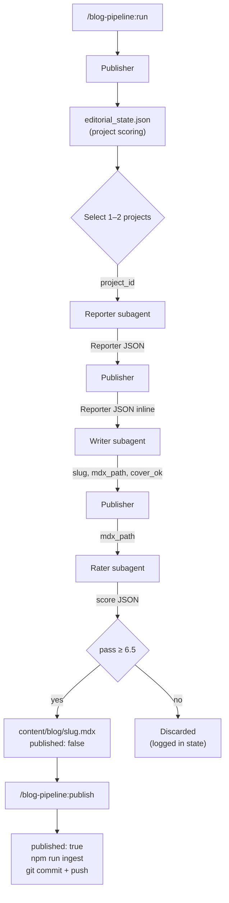

I have a problem with writing blog posts. Not the writing part exactly, but the discipline of actually sitting down to write them. I ship things, I think about them, I learn something, and then I move on to the next thing without ever writing it down. Three months later someone asks me what I've been working on and I say "a bunch of stuff" and wave my hand vaguely.

So I automated it. Sort of.

The blog pipeline plugin is a Claude Code plugin that reads my local git history, extracts what I actually built and why, and turns that into a complete MDX draft with a DALL-E 3 cover image. I review it, edit anything that's off, flip `published: true`, and push. The whole thing runs in the Claude Code terminal I have open anyway.

It's also the thing writing this post. There's a level of meta here I'm going to try not to dwell on.

{/*  */}

## What the Plugin Does

The pitch is simple: every blog post I publish starts from work that actually happened. I'm not generating content from thin air. The pipeline reads my git log for a configured lookback window (14 days by default), figures out what was actually interesting in that period, and writes a post about one of those things.

The output is a `.mdx` file dropped into `dimeglio.dev/content/blog/` with `published: false`. Nothing goes live until I've read it and approved it. The pipeline is an opinionated first draft, not a replace-the-human system.

Under the hood it's five skills wired together plus three standalone skills:

| Skill | Model | Role |
|---|---|---|
| Reporter | Haiku | Git history extraction. Structured JSON out. |
| Writer | Sonnet | Reporter JSON + voice rules → MDX + DALL-E 3 cover |
| Rater | Haiku | Rubric scoring + voice check. Pass threshold: 6.5/10 |
| Publisher | Sonnet | Orchestrator. Picks projects, manages editorial state |
| Social Manager | Sonnet | LinkedIn + X copy, interactive review loop |
| Rewriter | Sonnet | Targeted revision of an existing draft |
| Cover Regenerator | Sonnet | Regenerate DALL-E cover without touching the post |
| Deployer | Sonnet | Flip published, run ingest, commit, push on confirm |

The piece I interact with most is the Publisher, through `/blog-pipeline:run`. Everything else runs behind it.

## The Architecture

Each run starts with the Publisher reading `editorial_state.json` (a file I committed to the `dimeglio.dev` repo that tracks posting history per project). It scores every project and picks the top one or two for the day's run.

For each selected project, the Publisher spawns three subagents in sequence: Reporter extracts the git history as structured JSON, Writer turns that JSON into a complete MDX draft, and Rater checks whether the draft is worth shipping. Passing drafts land in the content directory.

*One /blog-pipeline:run from zero to a ready-to-review draft. Edges are labeled with the data crossing them.*

### How the subagent isolation actually works

The Publisher doesn't run Reporter, Writer, and Rater in its own context. It spawns each one as a *separate subagent*, each in its own context window, and passes only what that step needs.

The input contracts are narrow. Reporter receives a single argument (`project_id`) and reads `projects.config.json` itself. Writer receives the full Reporter JSON embedded inline in the Publisher's prompt. Rater receives just the path to the MDX file Writer wrote.

The outputs are similarly narrow. Reporter returns a JSON object to the Publisher's context. Writer writes the MDX to disk and returns a small envelope: `slug`, `mdx_path`, `cover_ok`. Rater returns a score JSON with pass/fail and per-axis numbers.

The reason that matters: Reporter's 30+ commit dump and full markdown trawl never reach the Writer's context. The Writer's full draft never reaches the Rater's. The Rater scores without seeing the raw source material, so it can't be biased by "wow look at all that git history." The Publisher is the only piece that holds full state. Everything else is stateless and operates on a slice.

After the pipeline, four standalone commands handle the post-pipeline work: `/blog-pipeline:rerate` to re-score after edits, `/blog-pipeline:rewrite` for interactive revision, `/blog-pipeline:cover` to regenerate the cover image without touching the post, and `/blog-pipeline:publish` to handle the full deploy flow.

{/*  */}

## How I Know the Output Isn't Lying

The obvious failure mode of a system like this is the LLM smoothing rough edges into plausible-sounding nonsense. Two layers guard against that.

The deterministic floor is the Rater's pre-check. Before the rubric scoring even runs, the Rater grep-scans the draft for em-dashes, banned buzzwords, audience-naming phrases, hyperbolic counting, roadmap labels, and the other shapes that read as AI tells. Any match is an automatic fail regardless of what the LLM rubric score would have been. Regex catches what regex can catch, and that's a hard gate.

The human ceiling is me. Every draft sits as `published: false` until I read it and flip the flag. The Deployer command exists to make that flip cheap, but it never runs unsupervised. The pipeline removes the blank-page problem; it doesn't remove the editorial step.

## Why These Tech Choices

The whole thing is a Claude Code plugin, which means it's mostly markdown files with frontmatter. Each skill is a `SKILL.md` with instructions, a model declaration, and an `allowed-tools` list. No build step. No npm publish. I clone the repo, point `settings.json` at it, and the commands show up in every Claude Code session.

I chose to put state in `editorial_state.json` committed to the `dimeglio.dev` repo rather than a separate store because the simpler the state, the less there is to break. It tracks last post dates, monthly counts, whether a project has had its intro post yet, and the current draft queue. Committing it to git means publishing history survives machine switches and I get a diff view of what changed each run.

For images, DALL-E 3 via the OpenAI key I already had for the site's RAG embeddings. Each image is about $0.04. The full pipeline per post runs to roughly $0.06 in API costs total. I considered fine-tuning a model for the image style per project, but the `image_theme` config blocks (per-project hex accents, style keywords, mood words) get me 90% of the way there without the overhead.

One choice I'm less sure about: I went with local repos via bash rather than GitHub MCP. The practical reason is that all my repos are on my machine already, and `git log` + `git diff` via bash is one line, not an MCP server. The tradeoff is that the pipeline only works when I'm on my own machine. If I ever want to run it in CI or on a remote server, I'll need to either add GitHub MCP or figure out how to clone on demand.

## What's Been Shipped

The plugin format is essentially documentation, which is why a small system like this comes together quickly. Most of the work was data contracts and state design, not code.

The first build was the core five-skill pipeline: Reporter → Writer → Rater → Publisher → Social Manager. That got drafts landing in the content directory and social copy ready to paste.

The second wave was the post-pipeline commands. The Deployer replaced the four manual steps I was doing to publish a post (flip frontmatter, run ingest, commit, push). The Cover Regenerator meant a bad DALL-E result wasn't a reason to re-run the full pipeline. The Rewriter let me make targeted edits with the same self-check rules the Writer uses, rather than hand-editing and hoping I didn't introduce an em-dash somewhere.

A round of bug-fixing came after the first real use. The Rater had drifted from the Writer's rules (it was checking different things than the Writer was enforcing). The Writer was occasionally inventing specific numbers not in the source data. Logo compositing on cover images was off-anchor. The Reporter was only reading the root README instead of every markdown file in the repo.

The intro mode (what produced this post) was an architecture change in the Publisher. When `has_intro_post: false` for a project, Publisher instructs Writer to produce an overview post before any feature posts. It's a one-bit flag in editorial state, but it changes what kind of post gets written.

## What I'm Working on Now

The pipeline is functionally complete. The main open question is whether the posts it produces actually get read, and whether they resonate with the people who do read them.

I added the Rater partly to answer that. It scores on substance, showcase value, and writing quality with a 6.5 composite pass threshold. But it's scoring against a rubric I wrote, which means it has the same biases I have. I want to see how the posts perform and tune the rubric against real engagement data.

The other thing on the list is session context extraction improvement. The Reporter can already pull user messages from Claude Code session JSONL files (those capture the real decisions and friction that never make it into commit messages), but the extraction is basic. I want to get better signal about the actual why behind each commit, not just the what.

## What Building This Was Like

The plugin format kept the engineering surface small. SKILL.md files are instructions, a model declaration, and an `allowed-tools` list. Claude Code reads them and knows what to do. So the work concentrated where it should have: the data contracts (what does Reporter emit, what does Writer expect) and the state design (what does Publisher need to track to make good decisions).

The thing that took the longest, proportionally, was getting the Writer to not sound like an AI. The banned patterns list in `AGENTS.md` (no em-dashes, no "not X, not Y, just Z" three-clause sentences, no climactic summaries) reads as obvious in hindsight, but the first drafts were reliably full of them. Getting the self-check gate to catch those patterns reliably was more iteration than I expected.

If I were starting over, I'd build the Rater before the Writer, not after. Having the scoring rubric nailed down first would have shaped the Writer's instructions more tightly from the beginning instead of converging through iteration.

The most useful thing I learned: subagent isolation isn't a performance optimization, it's a correctness one. The first version of the Rater ran in the Writer's context and quietly scored higher on drafts where the source git history looked impressive. Once I moved it to a separate subagent that only sees the finished MDX, the scores got harder and more honest. If you're considering the same approach, that's the property to build for. Give each step the smallest possible slice of the world and the system will tell you the truth more often. The repo is at [github.com/pdimeglio-dev/blog-pipeline-plugin](https://github.com/pdimeglio-dev/blog-pipeline-plugin) if you want to see how the slices are drawn.

---

*Built with Claude Code plugins, DALL-E 3, and the Claude Agent SDK. Deployed on Vercel. Source on [GitHub](https://github.com/pdimeglio-dev/blog-pipeline-plugin).*
