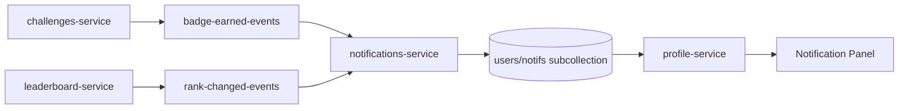

I had no way to tell a paddler when something happened on their account. You log a session, Strava fires the webhook, and within a minute or two your points are updated, your rank shifts, and any badges you triggered are awarded. Then nothing. You'd have to open the site and look. Was that badge from today's session? From last week? You'd have to check.

For a competitive platform, that's a weird silence. The whole point is that you're racing against other people. If you climb the leaderboard, you should know about it.

The thing is, the events were already there. Every badge award already published to `badge-earned-events`. Every leaderboard recalculation already knew who moved and where. I just needed something listening.

{/*  */}

## What the platform already knew

[The Paddle Games](https://www.thepaddlegames.com/) runs on a Pub/Sub event bus. When strava-integration-service ingests an activity, it publishes to `activity-recorded-events`. Challenges-service and points-calculator-service both subscribe to that topic and react. When points-calculator updates your score, it publishes to `points-updated-events`. Leaderboard-service picks that up, recalculates ranks, and writes the new order to Firestore.

If you earned a badge on that activity, challenges-service published to `badge-earned-events`.

So by the time your dashboard showed the new rank and the new badge, the entire system had already done all its talking (over Pub/Sub topics that were already wired up and live).

The architecture overview is in a separate post if you want the full picture.

## A service that only listens

I could have modified challenges-service or leaderboard-service to write notifications directly. I didn't. The clean version was a new service that subscribed to the existing topics and wrote notifications. No existing service needed to change.



*Events flow from existing services to the new notifications-service. Nothing upstream changed.*

The new service needed two Pub/Sub subscriptions and one Firestore write path. Leaderboard-service needed a small addition: it already recalculated ranks, but it wasn't publishing a `rank-changed-events` topic yet. I added that. When a user's rank improves (not just changes, improves) after a leaderboard update, it now publishes the event with the old rank, new rank, and user ID.

That's the only modification to any existing service. Everything else is new.

Setting up the Pub/Sub subscriptions for a new Cloud Function involves creating topics, service accounts, IAM bindings, and push subscriptions. I scripted all of it:

```bash
# services/setup-notifications-pubsub.sh (trimmed)
gcloud pubsub topics create rank-changed-events --project "$PROJECT_ID"

gcloud iam service-accounts create "$SA_NAME" \
  --display-name "Notifications Service SA"

gcloud pubsub subscriptions create notifications-badge-earned-sub \
  --topic badge-earned-events \
  --push-endpoint "$FUNCTION_URL/notifications" \
  --push-auth-service-account "$SA_EMAIL" \
  --ack-deadline 60
```

The script is idempotent. The `create` commands with `--quiet` skip if the resource already exists. Running it twice doesn't break anything.

Each Cloud Function handler is intentionally thin. Pub/Sub handles redelivery if a function crashes mid-execution. The idempotency guard is a deterministic Firestore document ID derived from the Pub/Sub message ID. If the handler runs twice on the same message, the second write overwrites with identical data:

```typescript
// services/notifications-service/src/handlers/badge-earned.ts (trimmed)
export async function handleBadgeEarned(messageId: string, data: BadgeEarnedPayload) {
  const notifRef = db
    .collection('users')
    .doc(data.userId)
    .collection('notifications')
    .doc(messageId);  // deterministic ID — idempotent on replay

  await notifRef.set({
    type: 'badge_earned',
    read: false,
    createdAt: FieldValue.serverTimestamp(),
    badgeId: data.badgeId,
    badgeName: data.badgeName,
    badgeImageUrl: data.badgeImageUrl,
  });
}
```

Nothing double-counts. The rank-improved handler uses the same pattern: Pub/Sub message ID as Firestore document ID, `set()` on an idempotent write.

## Where notifications live in Firestore

Each notification is a document in `users/{userId}/notifications`, which is a subcollection off the existing user document. The schema:

```ts
// From shared-types@1.3.0
interface NotificationDocument {
  type: 'badge_earned' | 'rank_improved' | 'announcement';
  read: boolean;
  createdAt: Timestamp;
  // badge_earned
  badgeId?: string;
  badgeName?: string;
  badgeImageUrl?: string;
  // rank_improved
  oldRank?: number;
  newRank?: number;
  leaderboardId?: string;
  // announcement
  title?: string;
  body?: string;
}
```

Profile-service (the BFF the frontend talks to) exposes two endpoints:

- `GET /profile/me/notifications`: reads the subcollection, sorted by `createdAt` desc, limited to 50.
- `POST /profile/me/notifications/mark-read`: marks one or all notifications as read.
- `DELETE /profile/me/notifications/:id`: removes one notification.

No direct Firestore calls from the browser. The frontend never touches the notifications subcollection directly.

{/*  */}

## The notification panel

In the nav, there's a bell icon. When there are unread notifications, it shows a red badge with a count. Clicking it opens a panel.

The frontend fetches notifications via TanStack Query, polling every 60 seconds when the page is active. The panel rows animate in with Framer Motion: trophy icon for badge awards, trending-up arrow for rank improvements, megaphone for admin announcements.

Mark-one-read fires on row click and updates the local cache optimistically before the POST returns. The X dismiss button removes the notification from the list immediately, then sends `DELETE`. If the delete fails, the item comes back on the next poll. It's not perfectly correct, but for a notification inbox where "slightly wrong for 60 seconds" is fine, optimistic updates keep the UI feeling fast.

The TanStack Query setup has one configuration worth noting: `refetchIntervalInBackground: false`. When the tab is hidden, polling stops. There's no point pinging profile-service for notifications the user can't see. When the tab comes back into focus, a refetch fires immediately via `refetchOnWindowFocus`.

```typescript
// src/api/profile/notificationsQueries.ts (trimmed)
export function useNotifications() {
  return useQuery({
    queryKey: ['notifications'],
    queryFn: fetchNotifications,
    refetchInterval: 60_000,
    refetchIntervalInBackground: false,
  });
}

export function useMarkNotificationsRead() {
  const queryClient = useQueryClient();
  return useMutation({
    mutationFn: markNotificationsRead,
    onMutate: async ({ ids }) => {
      await queryClient.cancelQueries({ queryKey: ['notifications'] });
      const prev = queryClient.getQueryData<Notification[]>(['notifications']);
      queryClient.setQueryData(['notifications'], (old: Notification[]) =>
        old.map(n => ids.includes(n.id) ? { ...n, read: true } : n)
      );
      return { prev };
    },
    onError: (_err, _vars, ctx) => {
      queryClient.setQueryData(['notifications'], ctx?.prev);
    },
  });
}
```

If the mark-read request fails, the cache rolls back to `prev`. The notification shows as unread again on the next render. Not elegant, but correct.

One thing that's deliberate: the panel only tells you about things that are good news. Rank drops don't trigger notifications. Losing a challenge doesn't trigger a notification. I don't want to build something that makes you anxious about opening it.

## What I got wrong the first time

The original version marked all notifications as read the moment you opened the panel. The intention was to clear the badge counter. What actually happened was: you open the panel to see what's new, everything is instantly marked read before you've had a chance to process it, and the counter goes to zero.

That's the wrong behavior. The badge counter should reflect whether you've actually read the notifications, not just whether you've opened the panel. I changed it so opening the panel does nothing to read state. A "Mark all as read" button shows in the panel header when there are unread items. Individual notifications mark themselves read when you click the row.

The other thing I got wrong: the initial panel implementation had the whole thing scroll, including the header. When you had eight notifications and scrolled down, the "Mark all as read" button disappeared off the top. Pinning the header fixed it. The notification list scrolls inside a fixed-height container, the header and close button stay visible.

Both of these were caught in manual testing before release. Neither involved code complexity, just UI judgment calls I got backwards the first time.

## Announcements

The third notification type is announcements. These aren't triggered by events. They're pushed from an admin script to all active users at once.

```js
// scripts/send-announcement.js (trimmed)
const snapshot = await db.collection('users')
  .where('isActive', '==', true)
  .get();

const batches = chunk(snapshot.docs, 499);  // Firestore batch limit
for (const batch of batches) {
  const writeBatch = db.batch();
  for (const userDoc of batch) {
    const notifRef = userDoc.ref.collection('notifications').doc();
    writeBatch.set(notifRef, {
      type: 'announcement',
      title: options.title,
      body: options.body,
      read: false,
      createdAt: FieldValue.serverTimestamp(),
    });
  }
  await writeBatch.commit();
}
```

Announcements render with a Megaphone icon and an amber left border when unread. They're useful for things like "new challenges added in the South Bay area" or "new scoring rule live", where the context is relevant to all users and doesn't fit neatly into the activity event flow.

## What's next

The notification system is live for all users. The next thing on the list for the platform is geo-based challenge improvements: there are now over 30 spatial challenges grouped by paddling area, and the map preview that shows route geometry inline was just shipped. That's probably the next post.

If you paddle SUP, kayak, canoe, or row, connect your Strava account and join at [thepaddlegames.com](https://www.thepaddlegames.com/). The notifications inbox means you'll actually know when you earn something.

---

*Built with Google Cloud Functions, Firestore, Pub/Sub, React, and TanStack Query. Deployed on GCP. Source on [GitHub](https://github.com/pdimeglio-dev/paddle-games).*
