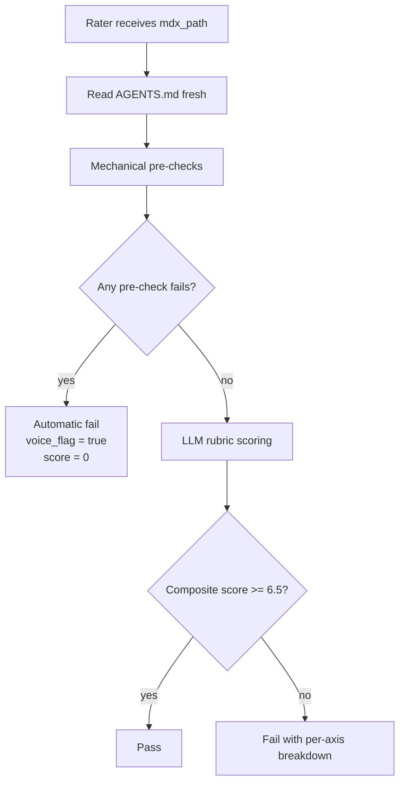

The Rater is supposed to be the quality gate. That's its whole job. The Writer produces a draft, the Rater reads the draft, and if the draft has an em-dash in it or uses a buzzword from the banned list or names the reader by their job title, the Rater fails it. Hard fail, no composite score, back to the queue.

The problem was that the Rater wasn't catching any of those things. It was passing drafts that had exactly the patterns it was supposed to block. And I didn't notice for about two weeks because the drafts looked fine on first skim.

I noticed because I read one of the posts properly, out loud, the way I do before hitting publish. It had a sentence with an em-dash joining two clauses, plus a line that opened with a defensive disclaimer about AI, the kind that signals the author is more worried about optics than about their point. Both are on the banned patterns list. The Rater had given the draft a 7.2. The Writer's own self-check should have caught both. Neither did.

So I started reading the rule definitions in each agent side by side.

{/*  */}

## What Each Agent Was Actually Checking

The Writer and Rater are both isolated subagents. They run in separate contexts. The Publisher spawns the Writer, gets back a `{slug, mdx_path, cover_ok}` envelope, then spawns the Rater with just the path to the MDX file. Neither agent sees what the other agent saw. That isolation is intentional (I wrote about why it matters for correctness in [the pipeline intro post](/blog/2026-05-14-pipeline-writes-my-blog-posts)), but it creates a specific maintenance problem: if the rules drift, nothing tells you.

When I wrote the original Rater, I paraphrased the Writer's rules into the Rater's instruction set. Same intent, different words. The Writer had a specific banned phrase it was required to grep for. The Rater said: "Check for defensive framing patterns." Those are not the same instruction. The Writer had specific text to match. The Rater had a category to reason about, which means the LLM could decide that a given sentence didn't really qualify.

The platform-framing rule was worse. The Writer had a specific, concrete rule: never frame a third-party platform (Strava, Shopify, Slack) as not caring about users or being deficient. Frame it as a community gap instead. The Rater had nothing equivalent. It was scoring voice quality without that constraint at all. A draft could criticize Strava for not serving niche sports communities and the Rater would mark it clean.

The CTA rule was a third variant: the Writer required a direct invitation to try the product when `goToMarketState` was `live`. The Rater's rubric had a "showcase value" axis but no specific check for whether the closing section had an actual call to action. The LLM would evaluate loosely where the Writer had enforced strictly.

| Rule | Writer behavior | Rater behavior (before fix) |
|---|---|---|
| Em-dashes | Grep the entire file including frontmatter | Grep body only, missed YAML fields |
| Defensive framing | Specific banned phrase list | "Check for defensive framing" (LLM reasoning) |
| Platform criticism | Named rule with examples | Not present |
| Live product CTA | Explicit gate: must appear in closing | Loose "showcase value" rubric axis |
| Unpublished links | Verify slug in generated-blog-slugs.ts | Not present |

The em-dash gap was the dumbest one. The Writer's self-check searched the file for the em-dash character, which is the right thing to do. But it only searched the body. Frontmatter fields like `description` and `coverAlt` weren't included. A draft could pass the self-check with an em-dash baked into the OG meta description that every card preview would display.

## Why This Happened

The immediate cause is that I wrote the two agents at different times, with different levels of concreteness in each instruction. But the structural cause is that I was treating the rules as "guidance for the Writer to follow" and "criteria for the Rater to evaluate," rather than as a single canonical source that both agents read.

I had one canonical source: `dimeglio.dev/AGENTS.md`. The Writer reads it fresh on every run before generating anything. But the Rater didn't. The Rater was working from a paraphrased summary I'd written directly into its instruction file, which had already diverged by the time I ran the first real pipeline.

The fix was conceptually simple but fiddly to execute. The Rater now:

1. Reads `AGENTS.md` fresh before scoring, exactly like the Writer does.
2. Runs the same mechanical pre-checks the Writer runs (em-dash grep on the entire file, buzzword scan, audience-naming pattern search, roadmap label check, platform criticism check).
3. Only proceeds to rubric scoring if all pre-checks pass. Any pre-check failure is an automatic fail regardless of composite score.
4. Independently verifies CTA presence when `goToMarketState` is `live` and `liveUrl` is set.
5. Verifies that every `/blog/<slug>` link in the draft exists in `generated-blog-slugs.ts` and has `published: true` in its frontmatter.

The structural fix was: make the Rater a skeptic about the Writer's self-check, not a rubber-stamp. The Rater shouldn't assume the Writer caught everything. It should verify independently.



*The pre-checks run before the LLM sees anything. A regex failure never makes it to rubric scoring.*

## The Fabricated Claims Problem

While I was in there fixing the rule divergence, I also added a guard I should have built from the start: checking that time estimates in the draft actually appear in the source data.

The Writer takes the Reporter JSON as its primary input. The Reporter JSON includes `session_context`, which is an array of verbatim user messages from Claude Code sessions. Those messages capture the real friction ("this took forever, had to restart the agent three times") that never shows up in commit messages.

The original Writer instruction said to use specific numbers, giving an example like "40 minutes fighting the typography plugin" rather than "some challenges." Which is good advice. The problem is that if the session context doesn't have a specific number, the LLM would sometimes invent one. "Took about 20 minutes" would appear in a draft when no such estimate existed anywhere in the source data.

The fix was a single concrete rule: all time claims must appear verbatim in `session_context` or the Reporter JSON. If you don't have a specific time from source data, don't write a time. Write what happened, not how long it took.

Similarly: the Writer would sometimes write about architectural phases using whatever label was in the commit message, including internal milestone numbers that mean nothing to a reader who's never seen the internal roadmap. The rule now says: no phase numbers, no sprint labels, no milestone names in the body. Use the user-visible capability name instead.

These rules are deterministic enough that the Rater can grep for them. `Phase [0-9]` as a pattern, numeric duration claims that don't match a string in the source JSON. The Rater runs both checks in the pre-check pass.

{/*  */}

## The Unpublished Link Problem

The link check was a different flavor of the same issue. The Writer, when drafting a post about the blog pipeline, would naturally want to cross-reference prior posts. So it would write something like "I covered the outbox pattern in an earlier post" and link to a slug that exists as a `.mdx` file but has `published: false`.

If that slug isn't in `generated-blog-slugs.ts`, the reader gets a 404. The Writer's only visibility into what's published is what it can infer from file existence. It doesn't know whether a file has been pushed through `npm run ingest` and actually has a live URL.

The Rater now does two checks for every `/blog/<slug>` link it finds in the draft body:

```bash
# Check 1: slug is in the generated list
grep -q '"<slug>"' "${dimeglio_dev_path}/lib/generated-blog-slugs.ts"

# Check 2: the MDX frontmatter says published: true
grep -q 'published: true' "${dimeglio_dev_path}/content/blog/<slug>.mdx"
```

Both must pass. If either fails, the Rater flags the link and the draft fails. The Writer is then supposed to either remove the link or replace it with prose ("a follow-up post" rather than a hard link).

This check catches a real problem: early pipeline runs produced drafts that linked to posts still in the queue. The drafts looked internally consistent (the slugs were real) but would have 404'd if published.

## The Permission Tax

The rule-drift and link-checking problems were about output quality. The other thing that made the early pipeline painful was the permission prompts.

Every time the Publisher spawned a subagent, Claude Code would stop and ask for approval. Reading `projects.config.json`. Writing to `dimeglio.dev/content/blog/`. Running `sips` to convert the cover image. Running `npm run ingest`. Each one required a manual click.

These are not sensitive operations. Reading a local config file, writing an MDX draft to a directory I own, running a build script. But the plugin hadn't declared them as pre-approved, so the permission system asked for every one, on every run, for every subagent invocation.

A full pipeline run involves spawning the Reporter, the Writer, and the Rater in sequence, each of which touches multiple files and runs multiple commands. In early testing that was somewhere around twenty-five manual approvals per run. The tool was supposed to free me from writing blog posts manually. Instead I was sitting there clicking "Allow" every thirty seconds.

The fix was declaring the expected operations upfront in the Publisher's `allowedTools` list. Reads of known config paths, writes to specific directories, a handful of bash commands the pipeline legitimately needs. Eight entries. After that, the pipeline ran start-to-finish without interruption.

The broader point: an automation that requires continuous manual attention is not an automation. It's a script with a human in the loop at every step. If you're building something that's supposed to run in the background, the permission model is part of the design.

## What the Writer Missed About Itself

The em-dash coverage gap was embarrassing because the Writer's own self-check listed "zero em-dashes in the entire file" as a requirement, and then only searched part of the file. It's the kind of thing that's obvious in retrospect.

The fix was extending the grep to the full file content, including YAML. In practice, em-dashes in frontmatter were rare. But `description` and `coverAlt` fields are rendered in listing cards and og:meta, which means they're visible outside the post body. An em-dash in `description` shows up in the site's blog index, in Twitter cards, in Google previews. It's actually a worse place to have one than in the body, because fewer readers will see the full post but many will see the card.

So the full-file search was worth adding even if the failure rate was low.

## What I'd Have Built Differently

Not much, structurally. The isolation between Writer and Rater is correct. Having the Rater run in its own context without access to the git history or the Reporter JSON means it scores only what the reader sees, which is the right property to optimize for.

What I'd have done differently is write the Rater first and the Writer second. The Rater's pre-checks define what "correct" looks like. If you write them first, you're writing a spec the Writer then has to satisfy. If you write the Writer first, you're writing rules and then hoping the Rater applies them the same way, which is exactly the drift I described.

The same lesson comes up in testing: write the test before the implementation. Here it applies to agents: write the validator before the generator. The generator's job is to satisfy the validator, not to produce something that seems good and then hope the validator agrees.

The other thing I'd do differently: make the Rater read `AGENTS.md` from day one. The rule was already there for the Writer. It took about five minutes to add the same instruction to the Rater. The reason I didn't do it initially is that I thought of the Rater as a rubric scorer and the Writer as a rule follower, and those felt like different things. They're not. A rubric scorer that doesn't know the same rules as the generator is scoring against the wrong criteria.

## The Post That Caught It

The sentence that flagged the problem was in the first draft of the observability post. The draft got a 7.2 from the Rater. I read it end-to-end before running the Deployer command, which is when I caught the defensive framing and the punctuation problem.

The post went through a Rewriter pass (`/blog-pipeline:rewrite` applies targeted edits against the same voice rules) and then a `/blog-pipeline:rerate`, and came back at 6.8 after removing the flagged sentence. Still above threshold. There was also an em-dash in the frontmatter description that I found separately and fixed by hand.

After the fixes to the Rater, I ran it against the same original draft. Automatic fail. Pre-check caught the em-dash in frontmatter and the defensive framing phrase in the body. No composite score computed. That's the behavior I wanted from the start.

The pipeline is more defensive now. Whether the posts it produces actually resonate with readers is still the open question. The Rater scores against a rubric I wrote, which means it has the same biases I have. That's a problem the pipeline can't solve for itself.

---

*Built with Claude Code plugins, gpt-image-1, and more AGENTS.md iterations than I expected. Deployed on Vercel. Source on [GitHub](https://github.com/pdimeglio-dev/blog-pipeline-plugin).*
