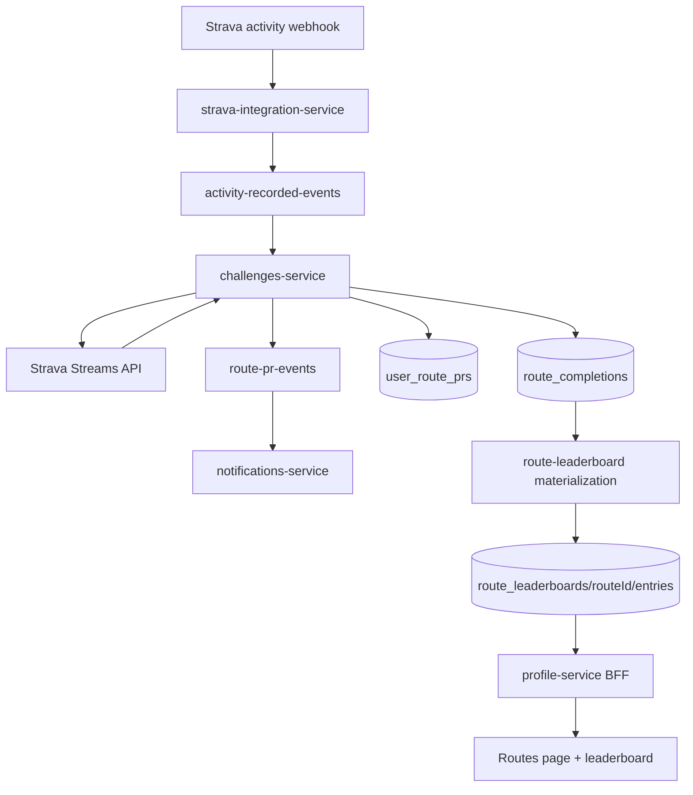

The challenge system already had named routes. You could earn a badge for completing Richardson Bay Loop or Bay Circuit, and the app tracked whether your GPS track covered enough of the route geometry. What it didn't do was tell you how fast you went, how your time compared to other paddlers, or even how many times you'd done that route. It just said "badge earned" and moved on.

That felt incomplete. A route badge is a one-time thing. The interesting question is your third time on that route versus your best time, or where you rank against the three other people who paddle it regularly. The competitive layer was the whole point of [The Paddle Games](https://www.thepaddlegames.com/), and routes had been sitting outside it.

So I built out route completions: gate-to-gate timing from Strava's streams API, completion history per user, personal records, and a leaderboard for every named route. And then I shipped a bug where loop routes kept finishing before they started, which was a whole thing.


## Where the timing data actually comes from

When Strava records an activity, it stores a stream of per-point data alongside the activity record: timestamps, GPS coordinates, altitude, heart rate if available. The main activity object gives you total distance and elapsed time. The streams API gives you the granular breakdown, where each array index corresponds to a GPS waypoint with a matching timestamp.

That distinction matters for gate-based timing. A route has a start gate (a GPS polygon covering the typical start zone) and a finish gate. To compute a completion time, you can't just use the activity's total elapsed time, because the paddler might have paddled to the start gate from a dock half a mile away, or cooled down for ten minutes after crossing the finish. You want the time between when the GPS track first crosses the start gate and when it first crosses the finish gate.

```typescript
// services/challenges-service/src/lib/route-completion.ts (trimmed)
async function computeGateTimes(
  activityId: number,
  route: RouteDefinition,
  userId: string
): Promise<GateCrossingResult | null> {
  const [timeStream, latLngStream] = await fetchStreams(activityId, ['time', 'latlng']);

  const startCrossingIdx = findFirstGateCrossing(latLngStream, route.startGate);
  const finishCrossingIdx = findFirstGateCrossing(latLngStream, route.finishGate, startCrossingIdx);

  if (startCrossingIdx === null || finishCrossingIdx === null) return null;

  return {
    elapsedSeconds: timeStream[finishCrossingIdx] - timeStream[startCrossingIdx],
    startCrossingIdx,
    finishCrossingIdx,
    coveragePct: computeCoverage(latLngStream, route.geometry),
  };
}
```

Coverage percentage is the gate-crossing check's gatekeeper (sorry). Even if the GPS track crosses both gates, the track has to cover at least 85% of the route geometry to count as a completion. This filters out accidental crossings, like paddling past the start marker while coming back from somewhere else.

## Storing completions without double-counting

The completion logic runs inside challenges-service, which subscribes to `activity-recorded-events`. The same Cloud Function can run multiple concurrent instances when traffic spikes, and Pub/Sub will redeliver messages if an invocation fails or times out. The idempotency problem is real and had already bitten the platform once (the badge-earned double-crediting bug that went into points-calculator-service a few weeks earlier).

The pattern I used: derive a deterministic Firestore document ID from stable inputs, then use `set()` instead of `add()`. Two concurrent invocations racing to write the same completion will both write the same document with the same data, and the second write is effectively a no-op.

```typescript
// services/challenges-service/src/handlers/route-completion.ts (trimmed)
const completionId = `${userId}_${activityId}_${routeId}`;

await db
  .collection('route_completions')
  .doc(completionId)
  .set({
    userId,
    routeId,
    activityId,
    elapsedSeconds: crossing.elapsedSeconds,
    completedAt: FieldValue.serverTimestamp(),
    isPersonalRecord: false,  // updated in the next write
  }, { merge: false });
```

After writing the completion, the handler checks whether this time beats the user's existing best for that route, and if so writes to `user_route_prs` and triggers a PR notification event. The completion and the PR record are separate writes, but the completion ID prevents either from duplicating.



*Activity comes in, streams get fetched, completion is written, PR is checked, leaderboard is updated, notification fires if there's a new record.*

## Leaderboard materialization per route

The per-route leaderboard is a subcollection: `route_leaderboards/{routeId}/entries`. Each entry has `userId`, `bestTimeSeconds`, `totalCompletions`, and `lastCompletedAt`. The leaderboard is materialized at write time (when a new completion comes in), not computed fresh on each read.

The handler reads the existing entry for the user, compares against the new completion time, and updates if it's a personal best. Then it reads all entries for the route, sorts by `bestTimeSeconds`, and assigns ranks. Every completion on that route triggers a full rank reassignment across all entries in the subcollection.

That's a bit aggressive. For a route with two paddlers, it's fine. If a route somehow accumulated a few hundred completions, writing all those rank updates in a single operation would be slow and potentially hit Firestore limits. Right now the user base is small enough that this hasn't been a problem. When it becomes one, the fix is to compute rank at read time instead of write time, which profile-service can do against a sorted index. That's the escape hatch if needed.

Profile-service (the BFF the frontend calls) exposes three new endpoints:

| Endpoint | What it returns |
|---|---|
| `GET /profile/me/routes` | List of routes the user has completed, with best time and last completed date |
| `GET /profile/me/routes/:routeId/completions` | Paginated completion history, cursor-based |
| `GET /profile/me/routes/:routeId/leaderboard` | Ranked entries for the route |

The frontend never talks to challenges-service directly. All route data goes through profile-service.


## The loop route problem

Routes forming a loop (same GPS point at start and end) were triggering false finishes. This took longer to fix than it should have, partly because it's not obvious until you trace through what `findFirstGateCrossing` does on a loop.

The function scans the GPS track array from the beginning, looking for the first point inside the gate polygon. For a loop route where the start gate and finish gate are at the same location, the very first thing it finds at the start of the scan is the start crossing. Good. Then it scans for the finish gate from that index onward. And since the start gate and finish gate overlap, it finds the "finish" at nearly the same point it found the start, before the paddler has gone anywhere.

```
Route: [start gate] -------- [middle] -------- [start gate / finish gate]
Track: ...GPS enters start gate at index 3...
       → looks for finish gate after index 3
       → GPS is still near start at indices 4, 5 (GPS is noisy near gates)
       → finish found at index 5
       → elapsed time: 2 seconds
       → completion written
```

A two-second lap record, obviously wrong. The figure-8 variant had a similar failure mode where the track crossed the gate partway through the route on the way to the second loop.

The fix has two parts. First, a minimum distance requirement between the start crossing index and the finish crossing index: the finish only counts if the GPS track has traveled a meaningful fraction of the route's total distance after crossing the start gate. Second, a minimum coverage percentage check before writing any completion, which was already in the logic but wasn't being applied before the gate search.

```typescript
// services/challenges-service/src/lib/route-completion.ts (trimmed)
const finishCrossingIdx = findFirstGateCrossing(
  latLngStream,
  route.finishGate,
  startCrossingIdx + MIN_POINTS_BETWEEN_GATES  // must have traveled significantly
);

// Also: coverage is checked after both crossings are found
if (crossing.coveragePct < ROUTE_COVERAGE_THRESHOLD) return null;
```

`MIN_POINTS_BETWEEN_GATES` is calculated from the route's geometry. If the route is 5km and the GPS logs at roughly 5-meter intervals, that's about 1000 points. Requiring at least 800 points between the start and finish crossings means the paddler covered roughly 80% of the route between gates before the finish registered.

After fixing the logic, there was a backfill: any loop or figure-8 routes that had logged false completions needed those recomputed. A one-off script replayed those route IDs through the updated logic against stored Strava stream data. The false completions got deleted, correct ones got written where applicable.

## PR notifications in the inbox

The [notifications inbox post from a few days ago](/blog/2026-05-20-paddle-games-got-a-notifications-inbox) covered how badge and rank alerts flow to users. Route PRs plug into the same system. When a new completion beats the user's existing best, challenges-service publishes a `route-pr-events` message, notifications-service picks that up and writes a notification to the user's subcollection.

Three scenarios trigger a route notification:
1. New personal record (any improvement on your best time)
2. First time in the top 3 on that route's leaderboard
3. Your rank on that route changes after someone else beats your time

The third one is the interesting case. If three other paddlers complete a route and all beat your best time while you're not actively paddling, your rank on that route drops. You get a rank-change notification without having logged an activity. That's the same behavior as the global leaderboard notifications, applied per route.

## What the routes page looks like

The routes page in the sidebar shows every route the user has completed, each with a Mapbox static map thumbnail of the route geometry. The thumbnail is generated client-side using the Mapbox Static Images API, with the route's GeoJSON line layer overlaid in the platform's green. It loads fast and looks good even at thumbnail size.

Clicking a route opens a detail page with the completion history (infinite scroll, cursor-paginated from profile-service), your personal best prominently displayed, and the route leaderboard. The leaderboard shows rank, display name, best time, and completion count. The user's own row is highlighted.

Completion history sorted by date shows the progression: your first time on a route, then each subsequent attempt. If you've run a route ten times and your best is your most recent, that tells a different story than if your best was six months ago and you've been slipping.

## The honest stuff

A few things that could be better:

The leaderboard rank reassignment on every write is going to be a problem if any route accumulates a lot of completions. It's not a problem yet, so I shipped it the simple way. The escape hatch exists (sort at read time in profile-service), but it would require adding a sorted index query to every leaderboard read. Not complex, just not done.

Rank notifications for routes you haven't paddled recently feel slightly intrusive. If someone beats your best on a route you last completed eight months ago, you get a notification for it. Maybe that's fine. Maybe there should be a cutoff. Haven't decided.

The Strava streams API call adds latency to the completion processing. Most activities process within a few seconds of the webhook, but the streams fetch adds a round-trip that can push it to 10-15 seconds for longer activities. The webhook returns 200 immediately (the processing happens async via Pub/Sub), so the user never sees this delay. It's just worth knowing the pipeline isn't as instant as it looks.

If you paddle and want to see where you rank on Bay Area routes, visit [thepaddlegames.com](https://www.thepaddlegames.com/) and connect your Strava account. The routes page is live.

One thing I didn't expect: a leaderboard with three entries is more motivating than one with three hundred. You know exactly who you're racing, and they show up to the same water you do. That's the version of competitive this platform was always supposed to be.

---

*Built with Google Cloud Functions, Strava Streams API, Firestore, Pub/Sub, Mapbox, and React. Deployed on GCP. Source on [GitHub](https://github.com/pdimeglio-dev/paddle-games).*
