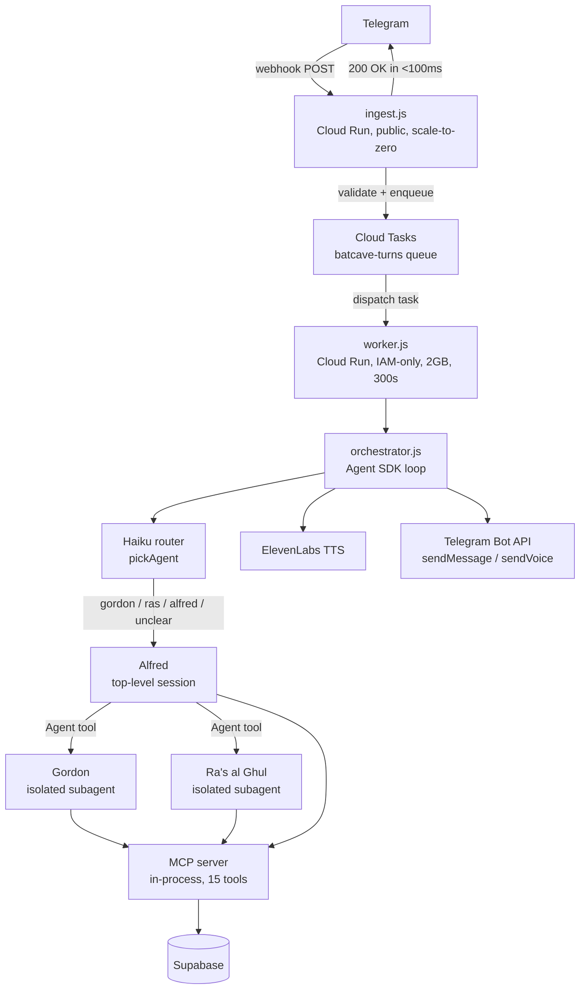

Everyone building a personal AI assistant seems to default to Jarvis. Reasonable template. I went with Batman instead. The Dark Knight Trilogy is one of the best comic adaptations ever made, and the characters are too good to just put on a poster. So I did the obvious thing: named each agent after someone from the movies, wrote their system prompts to match, and cloned their voices with ElevenLabs. If you're going to build a personal AI, you might as well make it one you actually want to talk to.

Alfred replies in Michael Caine's voice. Commissioner Gordon tracks your macros and reads nutrition labels from photos. Ra's al Ghul logs your workout sets and moves on without comment. Project Batcave is a personal AI assistant on Telegram, and all three of them run as separate Claude agents in isolated contexts, each one with its own voice, its own tools, and no access to what the others are doing.

It's a single-user system, auth-gated to one chat ID. The whole point was to build something that required solving real infrastructure problems rather than wiring together a few API calls. The architecture went through four distinct states to get to the current Cloud Run deployment, each one broken by a different assumption. That story is in the Evolution section.

This is the overview post. The next three in this series go deep on each agent. This one is the arc.

{/*  */}

## What the System Is

Project Batcave is a personal AI assistant reachable over Telegram. Text it, voice-note it, send it a photo of a nutrition label. Alfred responds in Michael Caine's voice (via ElevenLabs voice cloning). If you ask about food, he hands off to Commissioner Gordon. If it's a workout, Ra's al Ghul takes over. Each of them speaks in the voice of their character.

It's a single-user system. The Telegram bot is auth-gated to one chat ID. The whole point was to build something that required solving real infrastructure problems, not just wiring together a couple of API calls and calling it a day.

The stack: Claude Sonnet for the agents, Haiku for routing, Claude Agent SDK for the agentic loop, Supabase for persistence, OpenAI Whisper for transcription, ElevenLabs for TTS, and a two-service Cloud Run setup for the Telegram transport.

## The Evolution

The architecture went through four distinct states, each broken by a different assumption.

**Starting point: the VM.** GCP Always Free e2-micro, Ubuntu, PM2, `bot.launch()`. That starts a long-polling loop that calls `getUpdates` continuously. Fine on an always-on process. Alfred would receive a Telegram update, run, reply inline via `ctx.reply()`. Simple, cheap, worked.

Then I added Gordon and Ra's, and then I migrated to the Claude Agent SDK. The SDK spawns a Node subprocess for each `query()` call. A single agentic turn might spawn one subprocess for the router and another for the active subagent. The e2-micro had 1 GB of RAM. It was dead.

**First multi-agent design: shared context.** Before the SDK migration, Alfred had `transfer_to_gordon` and `transfer_to_ras` tools. When Gordon needed to respond, he ran in the same context window. The problem: Gordon and Ra's saw Alfred's full conversation history on every invocation. A conversation about grocery shopping would bleed into a workout log. It worked, but it was fragile.

**SDK migration: isolated contexts + Supabase.** The SDK gave me isolated subagent contexts. Alfred runs as the top-level session. Gordon and Ra's are invoked via the `Agent` tool, each getting only their own system prompt plus the task description Alfred explicitly passes. Alfred has to summarize the relevant context into the handoff, which turns out to be the right constraint. Explicit context-passing over implicit shared state.

Alongside this, SQLite and the JSONL vault came out. Everything went to Supabase: food logs, workout logs, session IDs, deferred state, user facts. A stateless container needs its state somewhere that isn't the container's disk.

**Cloud Run: webhooks and a queue.** Long-polling doesn't work on Cloud Run. Always-on Cloud Run is ~$45/month. Scale-to-zero plus long-polling means Telegram times out before the container warms. There's also a hard constraint: Telegram allows exactly one `getUpdates` consumer per bot token.

Webhooks are the answer, but there's a timing problem. An agentic turn takes 10-30 seconds (Whisper transcription, Haiku router, Claude Sonnet subagent loop, ElevenLabs TTS). Telegram's webhook retry window is shorter than that. If the handler holds the connection that long, Telegram assumes failure and retries.

The fix is a two-service split.

## The Request Path

*The ingest service acks Telegram immediately. The worker gets 300 seconds to finish the turn.*

The ingest service validates the `X-Telegram-Bot-Api-Secret-Token` header, extracts the `update_id`, and creates a Cloud Tasks task named `update-<update_id>`. Returns 200 in under 100ms. The worker picks up the task, runs the full agentic pipeline, replies via the Bot API.

The task naming gives idempotency for free. Telegram sometimes delivers the same webhook twice. A second delivery with the same `update_id` tries to create an `update-<update_id>` task, gets "already exists" from Cloud Tasks, and gets dropped. No double-logging, no duplicate voice replies.

Cloud Tasks also serializes turns: `max-concurrent-dispatches=1` means only one task runs at a time. Two overlapping agentic turns on the same `chatId` would both try to resume the same session, and the results would be unpredictable.

Cost at single-user volume: roughly $0-5/month. The always-on Cloud Run worker pool estimate was ~$45/month. The e2-micro was technically free but kept dying.

## The Agents

Three agents, each with a distinct job and a distinct voice.

**Alfred** is the top-level session. General conversation and user memory. He has three MCP tools: `recall_user_facts`, `store_user_fact`, and `AskUserQuestion`. He doesn't touch food or workout data directly. Voice: Michael Caine, cloned via ElevenLabs from Dark Knight trilogy audio clips.

**Commissioner Gordon** handles nutrition. USDA FoodData Central, Open Food Facts, 11 MCP tools covering everything from "log my lunch" to "show me last week's macros" to "save this as a meal template." He can read nutrition labels from photos: the image arrives as base64 in the Telegram update and goes into Gordon's prompt as a Claude vision input. No separate OCR step. Voice: warm and authoritative.

**Ra's al Ghul** handles workouts. Four tools: log a set, query workout history, recall and store user facts. No coaching, no motivation, just structured log rows. If Ra's started explaining periodization, users would stop logging and start chatting. The data stays clean because the agent stays focused.

| Agent | Role | Tools | Voice |
|---|---|---|---|
| Alfred | Orchestrator, conversation, memory | `recall_user_facts`, `store_user_fact`, `AskUserQuestion` | Michael Caine (cloned) |
| Gordon | Nutrition tracking | 11 nutrition MCP tools | Gary Oldman (cloned) |
| Ra's al Ghul | Workout tracking | `log_workout_set`, `workout_history` + memory | Liam Neeson (cloned) |

 

*Asking Alfred about a CrossFit class for the third time. He's not broken. He just has no idea the class exists. Calendar access is on the list.*

<YouTubeEmbed src="https://youtube.com/shorts/0U4jvTEe0kE" title="Project Batcave — food tracking demo with Gordon's voice" />

Each subagent context is isolated. Alfred holds the full conversation thread. Gordon and Ra's each get only their own system prompt and whatever Alfred explicitly passes in the task description.

## Memory

The system splits memory into two layers: what's shared across all agents, and what belongs to each one.

The shared layer is `user_facts`. Any agent can write a fact about the user via `store_user_fact` and read from it via `recall_user_facts`. Alfred stores conversation preferences. Gordon stores dietary restrictions and macro goals. Ra's stores training PRs and injury notes. They all pull from the same table. A food allergy Gordon learns about is available to Alfred the next time it comes up in conversation.

Each agent also has its own conversation thread. Alfred holds the full thread; Gordon and Ra's each get a fresh one per invocation, seeded with only their system prompt and whatever Alfred passed in the task description. They don't see Alfred's history or each other's. The thread itself lives in the SDK's local transcript, not in Supabase. Supabase stores only the session ID that points at it, which has consequences on a stateless container (more on that in the Reliability section).

Gordon and Ra's also have domain-specific episodic stores. Gordon owns `food_log`, `nutrition_goals`, `custom_foods`, and `saved_meals`. Ra's owns `workout_log`. Alfred doesn't touch either. He routes to the right agent instead of querying data that isn't his to manage.

Four tiers in total:

| Tier | Storage | Scope | Survives scale-to-zero? |
|---|---|---|---|
| Working | RAM | Per-turn | No |
| Conversation | SDK transcript (local disk) | Per-agent thread | No, best-effort |
| Semantic | Supabase `user_facts` | Shared across all agents | Yes |
| Episodic | Supabase `food_log` / `workout_log` | Agent-specific | Yes |

## The MCP Server

The MCP server runs in-process. `createSdkMcpServer` registers all 15 tools in the same Node process as the worker. The domain logic lives in three modules (`mcp/nutrition.js`, `mcp/workouts.js`, `mcp/memory.js`) that are plain JS imports.

Skipping the separate-process approach eliminated IPC overhead and a second service to deploy and monitor. The tools are all Supabase calls with some light business logic on top. Nothing here needs isolation from the main process.

## Reliability

Several things were designed in specifically for failure.

**Idempotency.** Telegram sometimes delivers the same webhook twice. Named Cloud Tasks (`update-<update_id>`) make this a non-issue. A duplicate delivery tries to create a task that already exists, gets ALREADY_EXISTS from Cloud Tasks, and is dropped silently. No double-logging, no duplicate voice replies.

**Turn serialization.** `max-concurrent-dispatches=1` in the queue means only one agentic turn processes at a time per bot. Two overlapping turns on the same session would both try to resume it simultaneously, and the results would be unpredictable. The queue absorbs the overlap.

**Graceful session loss.** The conversation thread is the one piece of state that doesn't survive scale-to-zero, and the orchestrator is built to expect that. When a resume fails on a cold container, it catches the error, clears the dead session, and starts fresh instead of crashing. Why that's an acceptable thing to lose is its own section below.

**Cost controls.** Every agent has a `maxBudgetUsd` and `maxTurns` ceiling. A pathological input that triggers a long tool-call chain hits the circuit breaker and returns rather than running indefinitely. Gordon is the most exposed, since a complex meal log can chain several nutrition tool calls, so his ceiling is set accordingly.

**Eval gate.** The routing suite runs on every PR and blocks merge on regression. Prompt changes that shift routing behavior don't show up in code review. The eval gate catches them before they ship.

## Why Losing the Conversation Is Fine (For Now)

It's worth being precise about what "best-effort conversation" actually means, because it sounds worse than it is.

The thread resets across a cold start, and right now the deliberate choice is to let it. It works because of what the agents actually need to be useful. They don't need to remember that you said "log a banana" ten minutes ago. They need to remember that you're allergic to shellfish, that your protein target is 180g, and that you benched 225 last week. All of that is in Supabase and survives everything. The conversation transcript is short-term working memory, nothing more. Losing it across an idle gap costs you the ability to say "actually, make that two bananas" after the container has already scaled to zero, and not much else. For a single-user assistant you talk to in bursts, that's a fine tradeoff, and not persisting the transcript keeps the write path simple and the storage bill at zero.

There's no fallback to reach for, either. The Anthropic API is stateless, and the SDK keeps the transcript only as a local file. There's no copy of the conversation on Anthropic's side to fetch back. The local file is the only copy, which is exactly why losing the disk loses the thread.

If continuity across cold starts ever does matter, there are two ways to get it:

1. **Persist the session files.** Mount a Cloud Storage bucket as a volume and point the SDK's session directory at it. The transcripts outlive the container and `resume` keeps working with no code change. Cheapest path. The cost is GCS FUSE latency and the SDK writing a lot of small files to a network filesystem.
2. **Replay from the database.** Capture the SDK's message stream as each turn runs, store it in Supabase keyed by chat and agent, and rebuild the conversation from the database on a cold start instead of trusting the local transcript. More work and a write on every turn, but it puts conversation memory on the same durable footing as the facts and logs, and it doesn't depend on a filesystem mount.

For now it's neither. The agents remember who you are. They just don't remember the last thing you said, and so far that hasn't been a problem worth solving.

## Evals

LLM behavior is non-deterministic, which makes regressions hard to catch by hand. A prompt tweak that fixes one case can quietly break three others, and nothing throws an error. So the system has a five-suite eval framework in `evals/`, each suite aimed at a different failure mode.

| Suite | What it checks | Cases | Threshold |
|---|---|---|---|
| Routing | The Haiku router sends each message to the right agent | 30 | 95% |
| Tool selection | Agents call the tools they should and avoid the ones they shouldn't (never log food without searching first) | 15 | 90% |
| Faithfulness | What Gordon writes to the database matches what the user said (food name, grams, macros within tolerance) | 10 | 95% |
| Memory recall | A fact stored in one turn is recalled in a later, fresh session | 8 | 85% |
| Cost ceiling | Adversarial inputs (huge batch logs, 90-day history pulls) return within budget instead of running away | 5 | 100% |

Memory recall sits at 85% because an LLM judges whether the response actually used the fact, and that judgment carries some variance. Cost ceiling is the only suite at 100%, because a runaway turn is a safety property, not a quality one.

The problem with running all of that on every commit is speed. Four of the five suites drive the full agentic pipeline end to end: real `query()` calls, real tool execution, real Supabase reads and writes. A single faithfulness case can take 20 to 30 seconds, and they're non-deterministic enough that an occasional flake is expected. Block every PR on them and you'd be re-running red builds all day.

So the suite is tiered. The routing suite runs on every PR and blocks merge. It's fast, about 30 seconds for all 30 cases, and fully deterministic because it never spins up an agent. It calls the router's `pickAgent()` function directly and checks the returned name. No LLM turns, no tool calls, no database. Just the one classification decision, which also happens to be the thing most likely to break from a prompt edit.

The other four run on a nightly schedule. They're the slow, end-to-end, occasionally flaky ones, and a failure opens a GitHub issue instead of blocking a merge. The expensive checks still run every day against the real pipeline, but a flaky faithfulness case at 2am doesn't stand between me and a merge at 2pm.

## What's Here and What's Coming

The current state: Alfred handles general conversation and memory, Gordon handles nutrition including photo recognition, Ra's handles workouts. The system runs on Cloud Run, costs almost nothing at single-user volume, and the evals catch regressions before they merge.

The next three posts each focus on one agent: who they are, what they actually do today, and where the gaps are. Gordon is first, because he has the most to show. Alfred is next, and part of that post will be about what he doesn't do yet. Ra's is last, and it'll be honest about how simple he still is.

The actual lesson from this project is how much real engineering sits between "it works on my laptop" and "I'd trust this to run." Proper Telegram transport because long-polling dies on scale-to-zero. A queue for timing decoupling because agentic turns take 30 seconds and Telegram doesn't wait. Durable sessions because a stateless container can't hold conversation state. An eval suite because prompt regressions don't announce themselves. Two Cloud Run services instead of one. And underneath all of it, the Claude Agent SDK's agentic loop (the tool-call, result, re-invoke cycle that you'd otherwise have to write and maintain yourself, plus session resumption, subagent isolation, and cost controls, all built in). None of it is complicated in isolation. All of it has to be right at the same time. And none of it is specific to AI. It's the same distributed systems work you'd do for any service that needs to be stateless, reliable, and cheap to run. The agents are the product. Everything around them is just backend engineering. The hobby version ran fine on a free VM until it didn't. The production version took four architecture rewrites to get there.

---

*Built with Claude Agent SDK, Cloud Run, Cloud Tasks, Supabase, OpenAI Whisper, ElevenLabs, and more GCP IAM than I ever wanted to learn. Source on [GitHub](https://github.com/pdimeglio-dev/project-batcave).*
