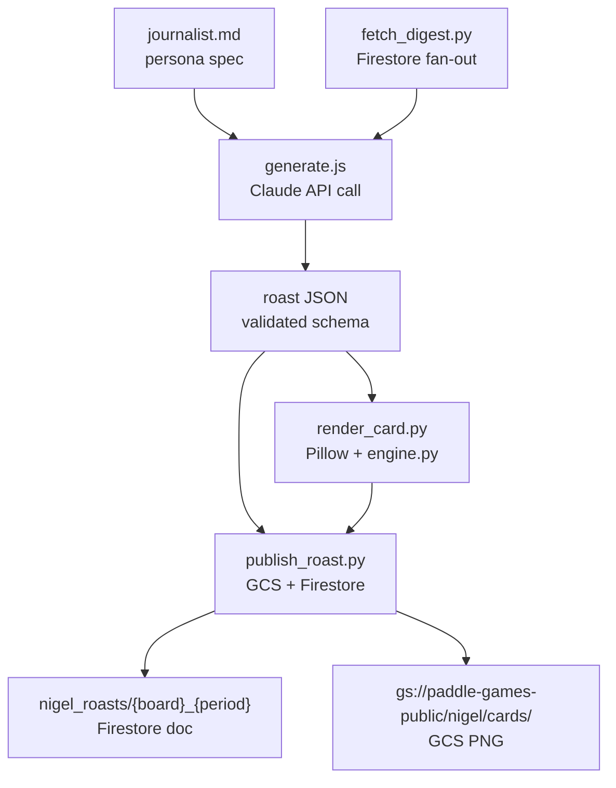
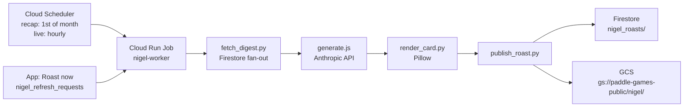

The whole leaderboard roast thing started as a bit. I was looking at the monthly standings, and the founder (me) was sitting somewhere embarrassing on his own leaderboard, and I thought it would be funny to have a ridiculous British sports correspondent narrate that. So I wrote a Claude Code skill that reads Firestore directly, generates the prose in character, and renders a 1080x1080 Instagram card with Pillow. I ran it manually a couple of times. It was, in fact, funny.

Then I started thinking about the broader problem. The Paddle Games needs content. Not just the roast, but feature announcements when something ships, location carousels when we add new routes and badges to a paddle spot, new-hire announcements if we ever want to introduce a character to the community. I was producing all of it by hand, or by invoking Claude Code skills one at a time. That worked, but it meant I had to remember to do it, which I often didn't.

So I built a plugin. The `paddle-games-tools` plugin has three skills, a shared rendering engine, and now a worker that runs the roast automatically in the cloud. This post is about how all of it fits together.

{/*  */}

## What the plugin does

The core idea is that all Instagram content for [The Paddle Games](https://www.thepaddlegames.com/) runs through one Claude Code plugin. Three skills, one shared Python rendering engine, one config doc in Firestore.

**feature-carousel** generates 3, 5, or 7-slide Instagram carousels for app feature launches. It reads the paddle-games source code to extract exact UI labels, option names, toggles, and routes before writing a word of slide copy. The slide count is dynamic based on how many screenshots you drop in the `screenshots/` folder. The output is a standalone Python script that calls `lib/engine.py` to render the slides.

**location-carousel** announces new routes, challenges, and badges for a paddle sports location. It fetches live data from the challenges service admin API, calls GPT-4o via the Responses API to generate a phone-in-scene background for slide two, pulls badge images from GCS, and drops a Mapbox static map into a phone mockup for slide four. State is tracked so already-featured items don't appear in future runs.

**leaderboard-roast** is the one that became interesting enough to automate. It reads every player's standings, badges, challenge progress, and route PRs directly from Firestore using ADC, then generates a sports-journalist-style roast narrated by Nigel Splashforth. The rendered card is a 1080x1080 PNG with the journalist's avatar, podium rows, and a pull-quote. Output per run: `.md` roast, `.json` structured artifact, `.png` card, `.social.txt` caption.

All three skills write output inside the plugin directory. Nothing goes into the paddle-games repo.

```
paddle-games-tools-plugin/
├── lib/
│   ├── engine.py          # shared Pillow drawing engine
│   ├── fetch_digest.py    # Firestore fan-out (used by worker)
│   ├── publish_roast.py   # GCS upload + Firestore write (used by worker)
│   └── render_card.py     # card renderer (used by worker)
└── skills/
    ├── feature-carousel/SKILL.md
    ├── location-carousel/SKILL.md
    └── leaderboard-roast/SKILL.md
```

## The shared rendering engine

Every skill that produces a PNG card uses `lib/engine.py`. It defines the design tokens (colors, fonts, padding constants), all the drawing primitives (`pill`, `card`, `gradient_line`, `brand_footer`, `icon_trophy`, phone mockup), and the glow helpers. Skills import it and call the primitives without touching the engine itself.

The design language is consistent across all three skills: dark background, lime-green and cyan accents, Lato typeface, dual asymmetric glows. A feature-carousel slide and a leaderboard-roast card look like they come from the same product because they use the same code.

The font situation is worth mentioning. Locally, the engine loads Lato from the system font path. In Docker (the worker environment), the fonts weren't there. The `node:22-slim` base image doesn't include `fonts-lato`, so the initial container builds failed at render time with a font-not-found error. Fixed with one line in the Dockerfile's `apt-get` step, but it took a few failed Cloud Build attempts to find it.

```dockerfile
# worker/Dockerfile (trimmed)
RUN apt-get update && apt-get install -y \
    python3 python3-venv python3-pip \
    fonts-lato \
    && rm -rf /var/lib/apt/lists/*
```

## Nigel Splashforth

The persona lives in a spec file: `skills/leaderboard-roast/assets/journalist.md`. It defines the voice, the look, the signature bits, and the exact image generation prompt. The journalist avatar was generated once via the OpenAI Responses API at `quality: "high"` and committed to the repo. It gets reused on every run. The consistency matters: if the character looked different each month, the gag wouldn't work.

On top of the base avatar, there's a 6-pose expression set: `nigel_hyped`, `nigel_shocked`, `nigel_callout`, `nigel_smug`, `nigel_deadpan`, `nigel_facepalm`. Each run picks an expression that matches the dominant beat of that roast. A month where the founder is sitting eleventh on his own board gets `nigel_facepalm`. A month with a genuine record gets `nigel_hyped`. The card uses the selected expression as the avatar.

There's also a new-hire mode. The first time anyone sees Nigel, he shouldn't just appear on a leaderboard card. He should be introduced. So the skill has a `--introduce` mode that generates a 1080x1080 meet-the-team card: centered portrait with a green ring, name, role ("Chief Paddle Correspondent"), tagline, and a caption. The template is generalized so it works for any future character introduction.




*How the automated worker runs a roast.*

## The roastable-user problem

Early versions of the spotlight section always targeted the founder. It was hardcoded: "A Word on the Founder," Pablo gets roasted, done. That worked fine when I was the only person on the app. It got less interesting once other people started using it.

The current design stores a roastable-user list in Firestore under `nigel_config/global`. A user opts in, their userId goes in `roastableUsers`, and they're fair game for a dedicated spotlight roast. `fetch_digest.py` reads this list on every run and tags each standings entry `roastable: true` or `false`. `generate.js` uses the flag directly from the digest. It doesn't re-query Firestore.

The spotlight selection uses a set of scored heuristics: longest absence, founder low on his own board, tight rivalry, ironic badge situation. The section title is dynamic to match the angle. The founder at rank 11 gets "A Word on Our Founder." A rivalry between two opted-in players might get "Under the Microscope." The comedy comes from picking the most dramatically roastable situation each run and naming it.

There's a subtle bug that bit me here. The config read was originally inside the per-player loop in live roast mode. So for a multi-player live run, it would re-query `nigel_config` for every player, and if the result changed between iterations (or if there was any lag), the `roastableUsers` list could differ between players in the same run. Hoisted the read above the loop.


## The worker

The manual-invoke model lasted about two months. Running the skill required a Claude Code session, fetching data, reviewing a draft, publishing output by hand. Fine for an occasional bit, not a recurring monthly feature.

The worker is a Cloud Run Job. Node.js + Python, Dockerized, deployed via `deploy.sh`. Two modes:

| Mode | Schedule | What it does |
|---|---|---|
| `recap` | 1st of month, 06:00 UTC | All enabled boards: fetch digest, generate roast, publish |
| `live` | Every hour | Check `nigel_refresh_requests`, regenerate only flagged boards, clear markers |

The live mode is the interesting one. When a user taps "Roast now" in the app, the app writes a document to `nigel_refresh_requests`. The hourly worker reads those requests, regenerates only the boards that were actually viewed while stale, and clears the markers. A board nobody visits costs zero. Many simultaneous viewers of the same board collapse to one generation. Ten people tapping "Roast now" within the same hour still only run the full pipeline once.

The per-board cost is roughly $0.02 to $0.05 (Claude Opus, around 3k tokens in, 1.5k out). Without the hourly window, a moment of social traffic (someone shares a leaderboard, five people tap in quick succession) would run the same generation multiple times for identical output. The hourly collapse bounds the cost to at most one live refresh per hour per board, regardless of demand. For a small app with an unpredictable spike pattern, that's a better control knob than rate-limiting at the API layer.



*The recap and live paths share the same generation and publish steps.*

The deploy script provisions the full infrastructure in one shot: Artifact Registry repo, Docker image build via Cloud Build, service account with Firestore/GCS/Secret Manager access, Cloud Run Job, two Cloud Scheduler triggers. You run `bash worker/deploy.sh` against a fresh account and it should work. One thing that didn't just work was Cloud Build logging. The initial `cloudbuild.yaml` used the default logging mode, which conflicts with a custom service account. Switched to `CLOUD_LOGGING_ONLY` and it stopped failing.

Cloud Run Jobs don't alert on failure by default; they log to Cloud Logging and move on. That's fine for a one-off job, but the monthly recap runs once every 30 days, which means a silent failure could leave the Firestore doc stale for a month before anyone noticed. I added a Cloud Monitoring alerting policy on `cloud_run_job/completed_execution_count` filtered to `result=failed`, wired to a webhook that posts to a Slack channel. The hourly live jobs are less critical (a missed run means the card is stale for an hour), but the recap failure alert is the one that matters.

## The data accuracy problem

The first generated caption cited a stat that didn't match the actual standings. A "43-point photo finish for second" that made narrative sense but was fabricated (the actual gap was different). The root cause was the caption prompt not enforcing a rule I had elsewhere in the skill: all numbers must be clearly sourced from the digest data.

This matters more than it sounds. The roast is supposed to be grounded in real stats. That's the whole conceit. Nigel's burns land because they're true. A made-up number breaks the bit, and if a player in the standings notices it, it breaks trust in the whole thing. The fix was tightening the caption generation step to require every figure to be traceable to the digest.

The general version of this problem: LLM-generated content will invent plausible-sounding specifics when given latitude. The countermeasure is not "trust the model" but "structure the output so invented specifics fail validation." The roast JSON schema has typed fields for `value` and `valueLabel` on each podium entry, pulled directly from the standings data. The prose that references those values has to come from the same source.

## What's next

The feature-carousel skill was recently rebuilt on the location-carousel architecture. Source-grounded slide copy instead of paraphrased descriptions, shared engine, dynamic slide count. That's a meaningful improvement over the original version, which was more or less a template filler.

The thing I'm still not sure about is Instagram-posting automation. Right now, the skills produce cards and captions, and I post them manually. Adding direct API posting isn't complicated, but it changes the stakes. A generated caption posted automatically is a different thing from one I've reviewed. For now, the workflow is: worker runs, pushes to Firestore and GCS, I review the card and caption in the app, and post when I'm satisfied. That extra step feels like the right call for content that goes out under the product's name.

You can follow the content this generates at [@the.paddle.games](https://instagram.com/the.paddle.games) on Instagram, if you want to see what Nigel has to say about the May standings.

---

*Built with Claude Code plugins, the Anthropic SDK, GCP Cloud Run, Firestore, GCS, and Pillow. Source at [github.com/pdimeglio-dev/paddle-games-tools-plugin](https://github.com/pdimeglio-dev/paddle-games-tools-plugin).*
