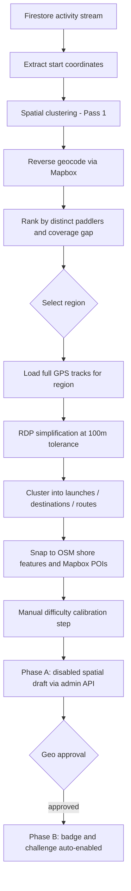

Every time I add a new route to The Paddle Games, I'm making a geographic bet. I browse a map, think about spots I personally know, and drop some pins. If I'm lucky, it's a place paddlers already go. If not, I've created a challenge somewhere nobody actually launches from, and the completion rate reflects that quietly.

The frustrating part is that I'm guessing when I don't need to. Every connected paddler on the platform generates GPS tracks that flow into Firestore via the Strava integration. Thousands of those tracks sit there, unused as content signals. They know where paddlers actually launch, where they turn around, and which corridors carry real traffic. I just wasn't reading them.

The opportunity-scout skill reads them. It's a Claude Code skill in the paddle-games-tools-plugin that takes the activity stream as input and auto-creates disabled draft routes and challenges via the admin API as output. This is the post about how it works.


## The GPS Data Already Knew

The Paddle Games stores GPS activity data from Strava in Firestore as part of the normal ingestion pipeline. Every completed activity carries a GPS stream, a start coordinate, an endpoint, and a simplified polyline. That data feeds the route leaderboard logic I covered in [Every Named Route Now Has a Leaderboard](/blog/2026-05-26-every-named-route-now-has-a-leaderboard). It was being used for challenge completion detection. It wasn't being used for challenge creation.

The opportunity-scout flips the question. Instead of "did this paddler complete this route?", it asks "where should the next route go?"

The skill runs as a subagent inside the paddle-games-tools-plugin, invoked from a Claude Code session. It receives no arguments to start (optionally a target region string to skip Pass 1), reads the Firestore activity stream and existing challenge docs via admin credentials sourced from GCP Secret Manager, and writes disabled draft spatial assets back to Firestore via the admin API. Visual confirmation artifacts get uploaded to GCS between phases so there's a reviewable record before anything commits.

## Pass 1: Which Region Has a Gap

The first pass works at the macro level. It pulls activity start coordinates from the Firestore stream and clusters them spatially across the full dataset. The output is a set of geographic regions, each representing an area where paddlers regularly put in.

The scoring matters here. Each region is ranked by distinct paddlers, not raw activity count. One person who paddles the same spot daily for six months would dominate a raw-count ranking. Scoring by distinct paddlers gives a clearer picture of which areas have broad community interest versus a single very consistent regular.

Each region gets reverse-geocoded via Mapbox to produce a human-readable label ("South San Francisco Bay", "Mission Bay"). The skill then cross-references against existing challenge coverage in Firestore to find areas with high paddler density but thin challenge presence. Those underserved regions rank highest.

The output is a ranked list. I pick one region and move to Pass 2.


## Pass 2: What's Actually in That Region

Pass 2 loads the full GPS tracks for activities that started in the chosen region. Before clustering, each track gets simplified via RDP (Ramer-Douglas-Peucker) at 100m tolerance. That trims a typical GPS track from thousands of coordinate pairs down to a manageable few hundred, which matters when you're doing spatial math across many activities at once.

The simplified tracks then get grouped into three cluster types:

- **Launches** (where paddlers put in, clustered from activity start coordinates)
- **Destinations** (where they finish or turn around, clustered from track endpoints and high-density reversal zones)
- **Routes** (common path corridors between launches and destinations)

The route corridors are the hardest part to get right. There's no clean algorithm for "find the common path" in GPS data with real-world variance. Paddlers hug different sides of islands, take different lines in crosswind, drift off-course and correct. The skill uses a simplified grid approach: divide the region into cells, count how many distinct track paths pass through each cell, and use sequences of high-scoring cells to define the corridor. It's a heuristic and it shows its limits on busy waterways where there genuinely isn't a canonical line.



*From raw GPS history to a live challenge, with one human approval gate in the middle.*

## The Shore Snapping Problem

This is the part I didn't anticipate. Spatial centroids of GPS clusters land in the water. Not near the water. Actually in it, sometimes several hundred meters from shore. A "launch point" floating in the middle of a bay is useless as a game landmark, and it would look absurd on the challenge card.

The fix is shore snapping. After clustering, the skill queries OSM via the Overpass API for real shore features within a configurable radius of each centroid. Target types are boat ramps, beaches, piers, and docks. A simplified version of the query looks like this:

```overpass
// (trimmed) — around 37.5, -122.2, 500m radius
[out:json][timeout:25];
(
  node["leisure"="slipway"]["access"!="private"](around:500,37.5,-122.2);
  node["natural"="beach"]["access"!="private"](around:500,37.5,-122.2);
  node["man_made"="pier"]["access"!="private"](around:500,37.5,-122.2);
);
out body;
```

The `access!="private"` filter came from early runs that kept returning private marina slipways. The skill also queries Mapbox for named POIs in the same radius, then scores candidates by distance and feature type (a named boat ramp beats an unnamed beach point). Each candidate landmark snaps to the highest-scoring qualifying feature.

The practical result: instead of a floating coordinate, you get "Coyote Point Boat Ramp" at a navigable, named location. That's what the Firestore schema stores, and that's what paddlers see on the challenge card when they're figuring out where to start.

The visual artifacts from this step get uploaded to GCS. Before Phase A creates anything, I review a satellite overlay of the proposed snap to catch the cases the filter doesn't. Even with `access!="private"`, a few sketchy ramps sneak through. The manual review is the safety net.

## The Two-Phase Creation Pattern

Before this skill, creating a new route challenge worked like this: build the spatial asset, save everything as disabled, manually review the geo placement, toggle it to enabled, then separately create the badge and challenge. That's fine for occasional creation. It's friction-heavy when you're reviewing a batch of scout suggestions.

The skill introduced a cleaner model:

| Phase | What gets created | Status after |
|-------|------------------|-------------|
| Phase A | Spatial asset (route geo, snapped landmarks, difficulty, point value) | Disabled draft |
| Phase B | Badge and challenge, linked to the spatial asset | Live and enabled |

Phase B auto-enables because the meaningful decision already happened in Phase A. Once I've confirmed the geographic placement and the landmark snapping looks correct, the badge name, point value, and challenge criteria are all deterministic from the route metadata. Distance and difficulty multiplier drive the points calculation. Region name drives the badge label. There's nothing left to decide after geo approval, so Phase B goes live immediately when triggered.

This collapsed a manual toggle step that existed between "I've reviewed and approved this" and "this is actually on the site." The admin API creates the badge and challenge atomically in Phase B, writing and enabling both in one call.

The same pattern now applies to the route-import skill (one-click Strava activity to draft route) and it's the right model for any content creation flow where geo approval is the real gate and the downstream artifacts are just configuration.

## Difficulty Calibration Is Still Manual

The points formula is `distance × difficulty_multiplier`. Difficulty is a per-route value I set, and the skill currently handles it with what the code honestly calls a "research step." I'm prompted to make a judgment based on the GPS track, the area's typical water conditions, and comparable existing routes in the database.

That's the accurate description. The data to do this better exists in Firestore: average completion times by experience tier, finish rates, performance distribution across similar paddlers. A new route where intermediate paddlers are consistently taking longer than their normal pace probably warrants a higher multiplier than one where everyone breezes through. I haven't built that inference.

The manual step works at current content volume, and it surfaces a real decision I should be making anyway. But it's the obvious candidate for automation when the content library grows past what one person can calibrate case by case.

## What the Skill Actually Changed

Content creation for [The Paddle Games](https://www.thepaddlegames.com/) was previously a founder staring at a map and making geographic guesses. If you've read [Behind The Paddle Games](/blog/2026-05-12-behind-the-paddle-games), you know the platform is built around geo-spatial challenges for paddle sports athletes, which makes the quality of those spatial decisions more important than it might sound. A challenge in the wrong spot just doesn't get completed.

The opportunity-scout doesn't replace the geo approval step and it doesn't replace difficulty calibration. What it replaced is the part where I was doing the wrong work: manually browsing maps for spots that "felt right" instead of reading the activity data that already knew where paddlers were going.

It's still a human-in-the-loop tool. I run it interactively in Claude Code, pick the region, review the snapped landmarks on a satellite overlay, and confirm before Phase A creates anything. Autonomous content publication isn't the goal. A misplaced landmark in the wrong bay would be genuinely confusing to paddlers trying to find it on the water, and the snapping heuristics aren't good enough to trust without a second pair of eyes.

The part that surprised me: getting the Overpass QL queries right took longer than the clustering logic. Overpass QL is its own thing, the `around` filter syntax is not intuitive, and the OSM tagging for water access features is inconsistent enough that you need a few iterations before the results are actually useful. The queries are in the skill body and they work. They're not beautiful, but they get the right boat ramps.

---

*Built with the Claude Code plugin SDK, Mapbox, OSM Overpass, Firestore, and Overpass QL queries that needed more iterations than expected to filter out private marinas. Source on [GitHub](https://github.com/pdimeglio-dev/paddle-games-tools-plugin).*
