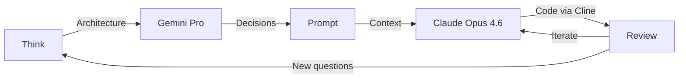
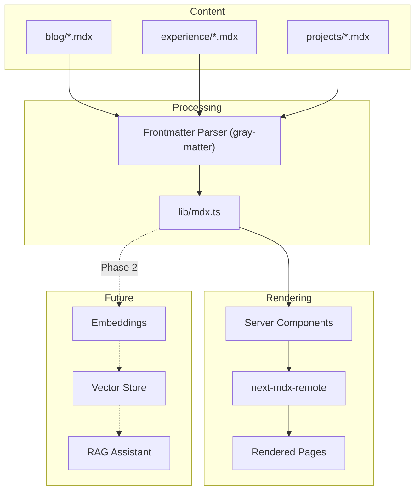
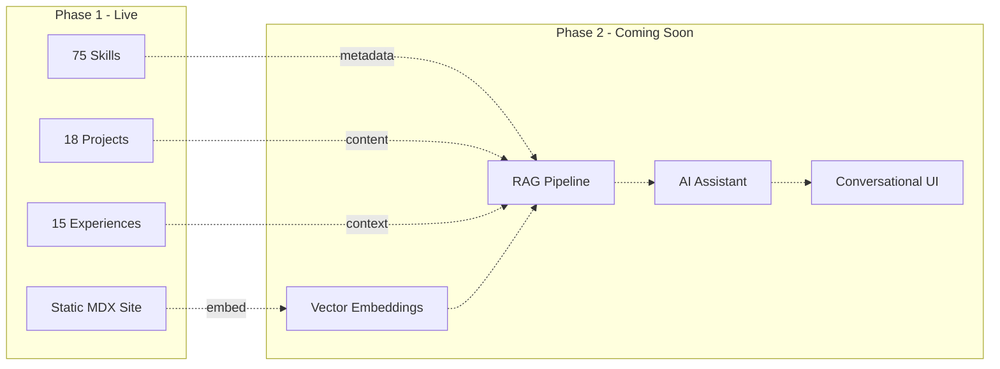

# How I Built dimeglio.dev in 3 Days with AI

What used to take 2–3 weeks took 3 days. Not because the scope was smaller — 18 projects, 15 experience entries, 75 unique skills, responsive design, dark theme, Vercel deployment — but because the way I work has fundamentally changed.

This isn't a story about AI replacing engineers. It's about what happens when a senior engineer with 14 years of experience uses AI as a force multiplier.

{/*  */}

## The AI Toolkit

Two models. Two jobs. One workflow.

**Gemini Pro** was the brainstorming partner. Before writing a single line of code, I spent time with Gemini discussing architecture decisions, design direction, content strategy, and the overall vision. What's the right tech stack for a portfolio that needs to evolve into an AI-powered experience? How should I structure content to be both human-readable and machine-queryable? What's the "Apple meets Gen AI startup" aesthetic actually look like in practice?

**Claude Opus 4.6** (via [Cline](https://github.com/cline/cline) in VS Code) was the execution engine. The brainstorming sessions with Gemini produced a detailed prompt — architecture decisions, design tokens, component hierarchy, content model — that became Claude's initial context. From there, Cline built the entire codebase through iterative pair programming.

The workflow looked like this:


*The AI-assisted development loop*

The key insight: **Gemini was the architect, Claude was the builder, and I was the tech lead** reviewing every pull request and making the final calls.

{/*  */}

## The 3-Day Timeline

Here's the actual commit history from the GitHub repository. 34 commits across 3 days:

### Day 1 — Foundation (April 9)

14 commits. From `git init` to a fully functional multi-page portfolio.

```
bdcedb5  feat: initial commit
205e676  docs: add architecture docs, ADRs, and Cline memory rules
32a0bd5  feat: configure dark theme, design tokens, and ThemeProvider
742e360  feat: MDX content architecture, blog dynamic route, and tests
41db06e  feat: navigation header and core pages (Home, Experience, Blog)
be42a27  feat: projects page with filtered grid, slide-out sheet, and URL sync
22499b6  fix: typography plugin and MDX server/client rendering
0102d5c  feat: add MDX content database validation script
9a4a5ec  refactor: skills source of truth moved to projects
9b7903a  feat: split experience page into jobs timeline + education/certs grid
8ba0a76  fix: separate Education and Certifications into distinct sections
02499d3  feat: comprehensive techStack audit for all 11 projects
1b03ba4  feat: integrate Aceternity UI Timeline for experience page
d870b61  Merge pull request #1 — feature/real-experience-timeline
```

By end of Day 1, the site had: a dark-themed home page with hero and bento grid, a projects page with filtering and slide-out detail sheets, a full experience timeline, a blog with MDX rendering and syntax highlighting, and a content architecture with typed frontmatter.

### Day 2 — Content & Polish (April 10)

14 commits. Filling in real data and polishing the UI.

```
6081eb2  feat(home): add logo strip, skills marquee, and refine page layout
e15ee22  Upgrades to project sheet slider
d783f22  Merge pull request #2 — feature/home-page-enhancements
ab0404e  Added project cards under experience. Changed styles on project sheets
950c622  Merge pull request #3 — feature/ui-cleanup
daf2169  RPotential experience and projects updated
6340028  Globant RAISE and extra test suite for rPotential
5a2a2ed  Style links
58e2e31  Adding google shopping details and screenshots
46ef8eb  Old Experience
f07e286  Adding missing logos
1b01dda  Merge pull request #4 — feature/improve-data
9b4dfb7  Skeleton Shimmer
cf34ba4  Merge pull request #5 — feature/skeleton-loader
```

Day 2 was about content density — populating every experience entry with accurate dates, roles, and achievements; adding project screenshots; creating SVG logos; and building UI enhancements like the logo ticker and skills marquee.

### Day 3 — Ship It (April 11)

6 commits. Media, mobile, and deployment.

```
16deda5  Added images and videos for some projects
9b6e17c  Preparing for future CDN
ded5124  Fix mobile responsive header
1ac48ae  Mobile responsive and Batcave demo
2563045  Merge pull request #8 — feature/projects-media
8dac282  Polish: rebrand, mobile fixes, skills audit, Vercel deploy
```

Day 3 ended with `vercel --yes --prod` and **dimeglio.dev going live**. 🚀

{/*  */}

## The Real Work: Data Curation

Here's the thing nobody tells you about AI-assisted development: **the code was the easy part.**

What actually consumed the most time — and the most mental energy — was going through years of old documentation, résumés, performance reviews, LinkedIn posts, and project notes to extract accurate, specific data points for each of the 18 projects and 15 experience entries.

Every title. Every date range. Every techStack array. Every key achievement. Verified against source material.

This wasn't busywork. It was strategic.

Every data point curated during this phase becomes a **fact the future RAG system can retrieve and cite with confidence**. Garbage in, garbage out applies doubly to AI systems. By investing in data quality during Phase 1, Phase 2's AI assistant will have a verified, structured knowledge base from day one — not a hallucination-prone summary of half-remembered bullet points.

## Architecture Decisions

### Why MDX for Everything

The entire content system — blog posts, experience entries, project descriptions — lives in `/content/` as MDX files with typed frontmatter:


*Content architecture: MDX files serve both the website and the future RAG system*

This was a deliberate choice. MDX gives us:

- **Structured frontmatter** — Every piece of content has typed metadata (dates, techStack arrays, categories, relationships) that's queryable and sortable
- **Rich markup** — AI agents are exceptionally good at generating MDX. Blog posts with code blocks, diagrams, and custom components can be authored in seconds
- **Relationship model** — Projects link to experiences via `associatedExperience` slugs, skills auto-aggregate from project techStacks, and the entire data model is self-documenting
- **Future-proof for RAG** — The same MDX files that power the static site will become the embedding corpus for an AI assistant. Structured markdown with frontmatter is the ideal format for chunking, embedding, and retrieval

### Server Components → Client Components

Next.js 16 defaults to Server Components — they run on the server, read files from disk, and ship zero JavaScript to the browser. But animations, scroll effects, and user interactions need the browser. The solution: **the server fetches and processes data, then passes it as props to interactive client components.**

```
Server Component (page.tsx)     → reads MDX files via lib/mdx.ts
       ↓ serialized props
Client Component (timeline.tsx) → renders with Framer Motion, hooks, scroll animations
```

For example, `app/experience/page.tsx` calls `getExperiences()` which reads every MDX file from `/content/experience/`, parses frontmatter with gray-matter, and returns typed TypeScript objects. Those objects pass as props to `<ExperienceTimeline>` — a `"use client"` component that renders the animated timeline with scroll-triggered animations.

The browser never sees `fs.readFileSync` or gray-matter — it only receives pre-processed JSON data. That's why the site loads fast: **zero runtime data fetching, all content baked in at build time.** Out of ~20 components, 14 are client components (for animations, filtering, carousels) and the rest are server components (for data fetching and static rendering).

### Why Not a CMS or Database?

For a personal portfolio with ~50 content files, a CMS adds complexity without value. The MDX files **are** the database:

```typescript
// lib/mdx.ts — The entire "backend"
export function getExperiences(): Experience[] {
  return readMDXFiles<ExperienceFrontmatter>("content/experience")
    .filter((e) => e.frontmatter.type === "job")
    .sort((a, b) =>
      new Date(b.frontmatter.startDate).getTime() -
      new Date(a.frontmatter.startDate).getTime()
    );
}
```

No API calls. No database connections. No CMS subscriptions. Just TypeScript reading files from disk — and everything is statically generated at build time.

### The Content-as-Data Philosophy

Every MDX file follows a strict schema. Here's what a project looks like:

```yaml
---
title: "Generative UI Engine"
description: "An AI-first platform where LLMs dynamically compose..."
category: "Professional"
company: "rPotential"
associatedExperience: "exp-rpotential"
techStack: ["React", "TypeScript", "GenUI", "Node.js", "Fastify",
            "LLMs", "Claude", "Gemini", "NDJSON Streaming"]
order: 1
---
```

This frontmatter is data. The body is content. The combination is powerful — you get the queryability of a database with the expressiveness of markdown. And when Phase 2 arrives, each field becomes a filterable attribute in the RAG retrieval pipeline.

## Media Strategy

Currently, all project screenshots and blog images live in `/public/` — served directly by Vercel's CDN. This works perfectly for launch, but the plan is:

1. **Now:** Static assets in `/public/projects/` and `/public/blog/`
2. **Soon:** Migration to **GCP Cloud Storage** with a CDN-fronted bucket
3. **Why:** Better cache control, image optimization, and decoupling media from the deploy pipeline

The codebase is already prepared — a `CDN_PREFIX` environment variable is ready for the switchover. One env change and all image URLs redirect to the bucket.

### AI-Generated Cover Images

Even the cover image for this post was generated by AI. The workflow:

1. A custom script (`scripts/generate-cover-prompt.mjs`) reads the blog post's frontmatter — title, description, tags, and section headings — and assembles an optimized image generation prompt
2. The prompt is fed into **Google's Imagen** (via Nano Banana), which generates a cover image matching the site's dark aesthetic
3. The image drops into `/public/blog/<slug>/cover.png`, the frontmatter gets a `coverImage` field, and it's done

The script ensures visual consistency across all posts — same color palette (black, slate, indigo, purple), same mood ("Apple meets AI startup"), same editorial quality. No design skills required, no stock photo subscriptions, and every cover is unique to its content.

It's another example of the theme: **AI doesn't replace the creative direction — it accelerates the execution.**

## What's Next: Phase 2

This portfolio is Phase 1 — the content layer. Phase 2 adds native AI capabilities:


*The roadmap: from static portfolio to AI-powered conversational experience*

The hidden AI Orb button on the homepage? That's the entry point. When Phase 2 ships, visitors will be able to have a conversation with an AI that knows my entire career — every project, every technology, every achievement — backed by the curated MDX content we built in Phase 1.

This is why every data point matters. This is why we spent more time curating content than writing code.

## The Meta-Observation

The most fitting thing about this portfolio is that **the way it was built is proof of the thesis it presents.**

The site claims I'm a Senior Full Stack Engineer who's AI Native. The site was built in 3 days by a senior full stack engineer using AI as a force multiplier. The architecture was designed with AI-first principles — structured content, embeddings-ready data, a RAG-compatible corpus.

The portfolio doesn't just describe the work. It *is* the work.

---

*Built with Next.js 16, Tailwind CSS v4, MDX, Framer Motion, and a lot of conversations with AI. Deployed on Vercel. Source code on [GitHub](https://github.com/pdimeglio-dev/dimeglio.dev).*
