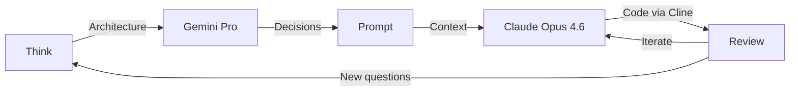
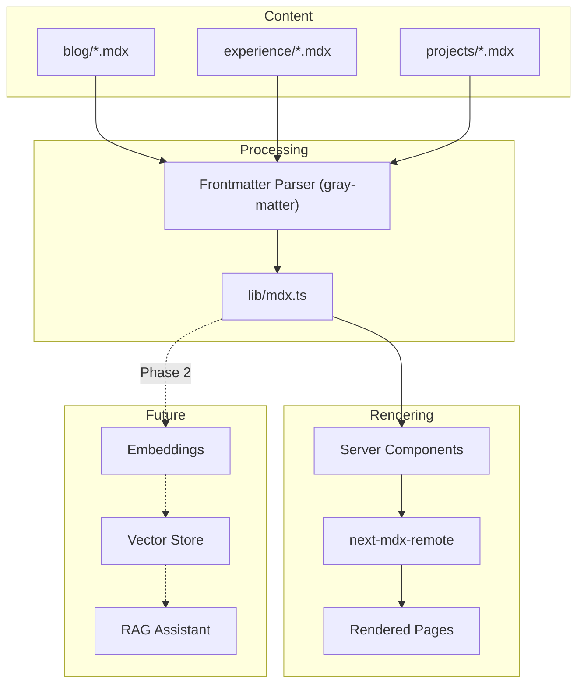
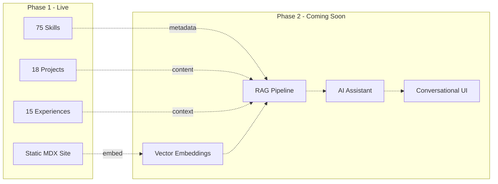

# How I Built dimeglio.dev in 3 Days with AI

I've been meaning to build a proper portfolio for... honestly, years. The kind of project that sits on your todo list so long it becomes furniture. I finally did it, and the whole thing took 3 days.

Not a landing page. 18 projects, 15 experience entries, 75 unique skills, responsive design, dark theme, blog with MDX, deployed to Vercel. Three days.

The short answer is AI. The longer answer is more interesting.

{/*  */}

## Two AIs, Two Jobs

I used two different models and they did very different things.

**Gemini Pro** was for thinking out loud. Before I wrote a line of code, I spent a few hours going back and forth with Gemini about architecture. What's the right stack for a portfolio that I want to eventually turn into an AI-powered experience? How should I structure content so it's both human-readable and machine-queryable later? I kept pushing on the aesthetic — I wanted something that felt like an Apple product page crossed with a Gen AI startup landing page. Gemini was good at bouncing ideas and poking holes in my assumptions.

**Claude Opus 4.6** (through [Cline](https://github.com/cline/cline) in VS Code) did the actual building. The brainstorming with Gemini produced a pretty detailed prompt — architecture decisions, design tokens, component hierarchy, content model — and that became Claude's starting context. From there it was iterative pair programming. I'd describe what I wanted, Claude would build it, I'd review, we'd go back and forth.


*How the loop actually worked*

If I'm being honest about roles: Gemini was the person I talked to at the whiteboard, Claude was the person who actually typed, and I was the one saying "no, not like that" a lot.

{/*  */}

## The 3-Day Timeline

Here's the actual commit history. 34 commits across 3 days — I'm including the real SHAs because I think it tells the story better than I can.

### Day 1 — Foundation (April 9)

14 commits. From `git init` to a working multi-page portfolio.

```
bdcedb5  feat: initial commit
205e676  docs: add architecture docs, ADRs, and Cline memory rules
32a0bd5  feat: configure dark theme, design tokens, and ThemeProvider
742e360  feat: MDX content architecture, blog dynamic route, and tests
41db06e  feat: navigation header and core pages (Home, Experience, Blog)
be42a27  feat: projects page with filtered grid, slide-out sheet, and URL sync
22499b6  fix: typography plugin and MDX server/client rendering
0102d5c  feat: add MDX content database validation script
9a4a5ec  refactor: skills source of truth moved to projects
9b7903a  feat: split experience page into jobs timeline + education/certs grid
8ba0a76  fix: separate Education and Certifications into distinct sections
02499d3  feat: comprehensive techStack audit for all 11 projects
1b03ba4  feat: integrate Aceternity UI Timeline for experience page
d870b61  Merge pull request #1 — feature/real-experience-timeline
```

See that `fix:` on commit `22499b6`? That was a good 40 minutes of fighting with the typography plugin and MDX rendering. Server Components can't use `useEffect`, and the MDX renderer kept trying to be a Client Component. Claude and I went in circles on that one before landing on the right pattern — server fetches the data, client renders the interactive parts.

By end of Day 1 the site had: a dark home page with hero and bento grid, projects with filtering and slide-out detail sheets, experience timeline, blog with syntax highlighting, and a content system with typed frontmatter. It was ugly in spots, but it worked.

### Day 2 — Content & Polish (April 10)

14 commits. This is where it got tedious.

```
6081eb2  feat(home): add logo strip, skills marquee, and refine page layout
e15ee22  Upgrades to project sheet slider
d783f22  Merge pull request #2 — feature/home-page-enhancements
ab0404e  Added project cards under experience. Changed styles on project sheets
950c622  Merge pull request #3 — feature/ui-cleanup
daf2169  RPotential experience and projects updated
6340028  Globant RAISE and extra test suite for rPotential
5a2a2ed  Style links
58e2e31  Adding google shopping details and screenshots
46ef8eb  Old Experience
f07e286  Adding missing logos
1b01dda  Merge pull request #4 — feature/improve-data
9b4dfb7  Skeleton Shimmer
cf34ba4  Merge pull request #5 — feature/skeleton-loader
```

Day 2 was mostly me sitting with old résumés, LinkedIn exports, and performance review docs, pulling out accurate dates, titles, and achievements for every single entry. AI couldn't help much here — it doesn't know what projects I worked on at Disney in 2019. I had to go dig all of that up myself.

I also spent way too long getting SVG logos to look right. White fills, no padding, consistent viewBox sizing. It's the kind of pixel-fiddling that AI is bad at and I find weirdly satisfying.

### Day 3 — Ship It (April 11)

6 commits. Mobile fixes, media, deploy.

```
16deda5  Added images and videos for some projects
9b6e17c  Preparing for future CDN
ded5124  Fix mobile responsive header
1ac48ae  Mobile responsive and Batcave demo
2563045  Merge pull request #8 — feature/projects-media
8dac282  Polish: rebrand, mobile fixes, skills audit, Vercel deploy
```

Day 3 ended with `vercel --yes --prod` and dimeglio.dev going live. 🚀

{/*  */}

## The Hard Part Wasn't Code

Here's the thing. The code was the fast part. Claude knocked out components, pages, and configurations quickly. What actually took the most time — and the most mental energy — was the data.

Going through years of old documentation, résumés, performance reviews, LinkedIn posts, and project notes to extract accurate, specific data points for 18 projects and 15 experience entries. Every title verified. Every date range checked. Every techStack array reviewed against what we actually used, not what the marketing deck said.

I did this carefully on purpose. Not just because I'm neurotic about accuracy (though I am), but because these MDX files are going to become the knowledge base for a RAG system in Phase 2. If the source data is sloppy, the AI assistant built on top of it will confidently repeat the sloppiness. I'd rather spend an extra day getting the facts right now.

## Architecture Decisions

### Why MDX for Everything

The entire content system — blog posts, experience entries, project descriptions — lives in `/content/` as MDX files with typed frontmatter:


*The same MDX files power the website now and will feed the RAG system later*

I went with MDX over a CMS or database for a few reasons:

- **Structured frontmatter** — Typed metadata (dates, techStack arrays, categories, relationships) that's queryable and sortable. It's basically a schema.
- **AI-friendly format** — AI models are really good at generating MDX. Blog posts with code blocks, diagrams, and custom components can be authored quickly.
- **Built-in relationships** — Projects link to experiences via `associatedExperience` slugs, skills auto-aggregate from project techStacks. The data model documents itself.
- **RAG-ready** — Structured markdown with frontmatter is close to ideal for chunking, embedding, and retrieval. The same files that power the static site will become the embedding corpus later.

### Server Components → Client Components

Next.js 16 defaults to Server Components — they run on the server, read files from disk, and ship zero JavaScript to the browser. But animations, scroll effects, and user interactions need the browser. So the pattern is: **server fetches data, client makes it move.**

```
Server Component (page.tsx)     → reads MDX files via lib/mdx.ts
       ↓ serialized props
Client Component (timeline.tsx) → renders with Framer Motion, hooks, scroll stuff
```

`app/experience/page.tsx` calls `getExperiences()` which reads every MDX file from `/content/experience/`, parses frontmatter with gray-matter, and returns typed TypeScript objects. Those get passed as props to `<ExperienceTimeline>` — a `"use client"` component that does the animated timeline with scroll-triggered animations.

The browser never sees `fs.readFileSync` or gray-matter. It just gets JSON. That's why the site loads fast — no runtime data fetching, everything's baked in at build time. Out of ~20 components, 14 are client components (animations, filtering, carousels) and the rest are server components (data fetching, static rendering).

### Why Not a CMS?

For a personal portfolio with ~50 content files, a CMS is overhead I don't need. The MDX files *are* the database:

```typescript
// lib/mdx.ts — This is the entire "backend"
export function getExperiences(): Experience[] {
  return readMDXFiles<ExperienceFrontmatter>("content/experience")
    .filter((e) => e.frontmatter.type === "job")
    .sort((a, b) =>
      new Date(b.frontmatter.startDate).getTime() -
      new Date(a.frontmatter.startDate).getTime()
    );
}
```

No API calls. No database connections. No CMS subscriptions. TypeScript reads files from disk. Done.

### Content-as-Data

Every MDX file follows a strict schema. Here's a project:

```yaml
---
title: "Generative UI Engine"
description: "An AI-first platform where LLMs dynamically compose..."
category: "Professional"
company: "rPotential"
associatedExperience: "exp-rpotential"
techStack: ["React", "TypeScript", "GenUI", "Node.js", "Fastify",
            "LLMs", "Claude", "Gemini", "NDJSON Streaming"]
order: 1
---
```

Frontmatter is data. Body is content. You get the queryability of a database with the expressiveness of markdown. And when the RAG pipeline comes, each frontmatter field becomes a filterable attribute in retrieval.

## Media

Right now all screenshots and blog images live in `/public/` — served by Vercel's CDN. It works fine for launch. The plan is to move to GCP Cloud Storage with a CDN-fronted bucket eventually — better cache control, image optimization, and it decouples media from the deploy pipeline. The codebase already has a `CDN_PREFIX` env var ready for the switch.

### Cover Images

The cover image for this post was generated by AI too. I wrote a script (`scripts/generate-cover-prompt.mjs`) that reads a blog post's frontmatter — title, description, tags, headings — and generates an optimized image prompt. That goes into Google's Imagen (via Nano Banana), out comes a cover that matches the site's dark aesthetic. Same color palette every time (black, slate, indigo, purple), same mood, every cover unique to its content.

I'm not a designer. This workflow means I don't have to be.

## What's Next

This portfolio is Phase 1 — the content layer. Phase 2 adds AI capabilities:



There's a hidden AI Orb button on the homepage. When Phase 2 ships, visitors will be able to chat with an AI that knows my entire career — every project, every technology, every role — backed by the MDX content from Phase 1.

That's why I was so careful about data quality. The AI assistant is only as good as the facts it can pull from.

## The Honest Takeaway

I've been building software for 14 years. This is the fastest I've ever gone from idea to production, and the output is legitimately better than what I would have built alone in 2-3 weeks.

But I want to be clear about what "with AI" means here. I still made every architecture decision. I still reviewed every component. I still wrote all the content data by hand from source documents. The AI didn't have opinions about whether to use a CMS or MDX files — I did. It didn't know what projects I'd worked on at Google — I did.

What AI did was eliminate the gap between "I know what I want" and "it exists." And for someone who's been doing this long enough to know exactly what they want, that gap shrinking changes everything.

---

*Built with Next.js 16, Tailwind CSS v4, MDX, Framer Motion, and a lot of back-and-forth with AI. Deployed on Vercel. Source on [GitHub](https://github.com/pdimeglio-dev/dimeglio.dev).*
