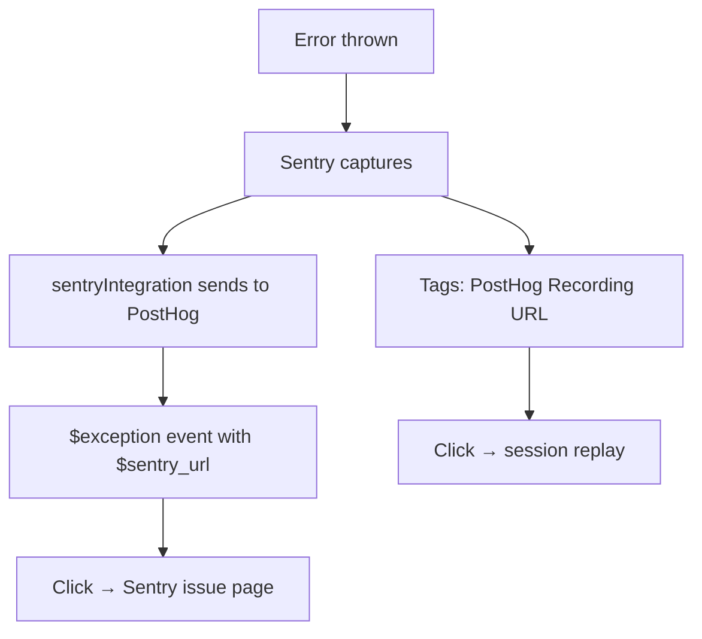

I wrote about building [Guillermo, the AI agent](/blog/welcome-guillermo-the-ai-agent) a few days ago. What I didn't write about was the part where I deployed him and immediately realized I was flying blind.

The site was live. The agent was live. People were visiting, chatting, clicking around. And I had zero idea what was actually happening. No error alerts. No usage data. No way to know if Guillermo was hallucinating, crashing, or just sitting there silently broken. The only signal I had was "nobody complained." Which, for a portfolio site, is not exactly a high bar.

So I spent a couple of days wiring up observability. Three tools, four layers, and (I'll admit it upfront) way more infrastructure than a portfolio site with 50 daily visitors actually needs. But it was a good excuse to learn, and the free tiers made the overengineering consequence-free. More on that later.

## Layer 1: LangSmith for the agent

Guillermo runs on gpt-4o-mini via the Vercel AI SDK, streaming responses to the frontend. He has five tools: one for RAG retrieval, four for rendering UI widgets. A typical conversation involves multiple tool calls, multiple LLM invocations, and a streaming response that builds up over several seconds. When something goes wrong, the question is always "what did the model decide to do, and why?"

That's what LangSmith is for. It captures traces of every conversation: what the user said, what Guillermo retrieved from Pinecone, which tools he called, what he responded with, and how long each step took. I can replay entire sessions and see exactly where things went sideways.

Getting it working was not smooth.

### The wrapAISDK deadlock

My first attempt used `wrapAISDK` from `langsmith/experimental/vercel`. Clean API. Promises automatic tracing with a waterfall view of every LLM call and tool invocation. Sounded perfect.

It deadlocked.

On multi-step conversations (the agentic ones where Guillermo calls `searchPortfolio`, gets results, then calls `renderProjectCard`), the last child span never closed. I'd see the trace in LangSmith with a dangling open span that never completed. Single-step conversations worked fine. Multi-step ones hung.

I spent an evening tracing through `langsmith/dist/experimental/vercel/index.js` to find the root cause. Here's what happens:

1. `wrapAISDK` wraps `streamText()` with `traceable()`
2. `traceable()` needs to know which property on `StreamTextResult` is the async iterable, so it can track when streaming is done
3. `wrapAISDK` is supposed to pass `__finalTracedIteratorKey: "fullStream"` for this
4. It doesn't pass it
5. Without it, `traceable`'s `processOutputs` tries to `await result.content`, which can't resolve until `fullStream` is consumed
6. But `fullStream` can't be consumed until `await streamText()` resolves
7. Deadlock

I tried everything:

| Approach | Result |
|---|---|
| `await result.text` in finally block | Works locally, dies on Vercel serverless (function terminates) |
| `after()` + `awaitPendingTraceBatches()` | Flushes pending batches, but the span was never *ended*, just unflushed |
| `traceable` with `__finalTracedIteratorKey` manually | Closes reliably but intermittent on Vercel; no waterfall |

### The workaround

I ended up dropping `wrapAISDK` entirely and using LangSmith's `Client` class directly:

```typescript
const langsmith = new Client();

// Before streaming
langsmith.createRun({
  id: runId,
  name: "guillermo-chat",
  run_type: "chain",
  project_name: "guillermo-chat",
  inputs: { messages },
  extra: { metadata: { session_id: conversationId } },
  start_time: Date.now(),
});

// After streaming completes, in the finally block
await langsmith.updateRun(runId, {
  outputs: { response: collectedOutput },
  end_time: Date.now(),
});
```

The key is that `updateRun()` is awaited before `controller.close()`, so the serverless function stays alive until the trace is closed. Ugly, but it works every time.

I lost the waterfall view (no child spans for individual LLM calls), but I kept the traces. I can see every conversation, replay the inputs and outputs, and group them by session. Good enough.

Conversation threading uses `session_id` metadata, which maps to a UUID generated per chat session on the frontend. The same ID is sent in PostHog events (`guillermo_message_sent`, `guillermo_chat_closed`) so I can cross-reference between the two systems.

If anyone has hit the same issue and found a cleaner workaround, I'd genuinely love to hear it. My guess is that passing `__finalTracedIteratorKey: "fullStream"` somewhere in `_getStreamTextWrapperConfig()` might be part of the answer, but I'm not deep enough in the internals to know for sure. I filed the observation in the LangSmith SDK repo in case it helps.

This solved the "is the agent working?" question. It did not solve "is the site working?"

## Layer 2: PostHog for analytics

Once the agent was traced, the next question was simpler: are people actually using this site? Which pages? Which projects get clicks? Do recruiters read the blog or bounce after 10 seconds?

I went with PostHog. A few decisions worth explaining:

**Cookieless mode.** PostHog is configured with `persistence: "memory"`, which means no cookies, no localStorage, no banner. Each page load is a fresh anonymous session. The tradeoff is that returning visitors aren't recognized across sessions, but for a portfolio site that doesn't matter. I need "did anyone click anything today," not "did the same person come back."

**Manual page views.** PostHog's autocapture is disabled. Page views are tracked manually via Next.js route changes in a `PostHogProvider` component. This gives me clean `$pageview` events with the actual path instead of whatever autocapture decides to label things.

**Typed event catalog.** Every custom event is defined as a TypeScript union type in `lib/analytics.ts`:

```typescript
export type AnalyticsEvent =
  | { event: "logo_clicked"; properties: { logo: string; href: string } }
  | { event: "blog_post_viewed"; properties: { slug: string; title: string; tags: string[] } }
  | { event: "project_card_clicked"; properties: { slug: string; title: string; company: string; category: string } }
  // ... ~20 more
```

The `trackEvent()` helper only accepts valid `AnalyticsEvent` payloads. If you typo a property name, TypeScript catches it at compile time. If you add a new event, you add the type first, and the type forces you to include all required properties at every call site.

There are about 20 custom events now: logo clicks, project card clicks, blog scroll depth (tracked at 25/50/75/100% thresholds), nav patterns, Guillermo chat opens and closes, contact form submissions, category filter changes.

## Layer 3: PostHog for errors

Analytics told me what people did. It did not tell me when things broke.

The site could be 500-ing right now and I'd have no way to know. Nobody emails you about errors on a portfolio site.

PostHog already had error tracking built in. Turning it on was mostly configuration:

**Frontend (automatic):** `capture_exceptions` in the posthog-js config catches unhandled errors and promise rejections. They show up as `$exception` events in PostHog.

**Frontend (manual):** A `captureError(error)` helper for catch blocks. Wraps `posthog.captureException()`.

**Backend (automatic):** Next.js 16 has an `onRequestError` hook in `instrumentation.ts` that catches all unhandled server errors (API routes, Server Components, Server Actions). I wired it to report via `posthog-node`.

**Backend (manual):** A `captureServerError(error, context)` helper for API route catch blocks. Calls `posthog-node` with route context for filtering.

**Error boundaries:** `app/error.tsx` catches route-level React render crashes, `app/global-error.tsx` catches root layout crashes. Both report the error and show a fallback UI with retry and home buttons.

**Source maps:** `@posthog/nextjs-config` uploads source maps during `next build` so production stack traces show real file names instead of minified garbage. Requires a personal API key with `error_tracking:write` scope, set in Vercel only.


## Layer 4: Sentry

PostHog's error tracking worked. I could see errors in a dashboard, filter by frontend vs server, see stack traces with real file names. For a portfolio site, it was probably enough.

But the debugging experience was shallow. No error grouping or fingerprinting. No release tracking. No breadcrumbs showing what happened before the crash. No performance traces. The stack trace was there, but the UI around it was minimal compared to a dedicated error tracking tool.

Sentry fills those gaps. The key decision was: I didn't want to replace PostHog for errors, I wanted both. PostHog gives me errors alongside session replays and analytics. Sentry gives me deep debugging. The question was how to connect them.

### The bridge

PostHog's JS SDK has a built-in `sentryIntegration()` that does exactly this. When Sentry captures an error on the frontend:



The integration creates a two-way link. See an error in PostHog, click through to Sentry for the full debugging context. See an error in Sentry, click through to PostHog to watch the session replay of what the user was doing. Both directions work.

Server-side is different. The `sentryIntegration()` bridge is browser-only (it's in `posthog-js`, not `posthog-node`). So `captureServerError()` calls both services explicitly:

```typescript
export function captureServerError(error: unknown, context?: Record<string, unknown>) {
  Sentry.captureException(error, { extra: context });

  const ph = getClient();
  if (!ph) return;
  ph.captureException(error, "server", context);
}
```

### Turbopack friction

One thing that cost me time: `@sentry/nextjs` uses a webpack plugin to auto-inject the `sentry.client.config.ts` import. Next.js 16 uses Turbopack by default. Turbopack doesn't run webpack plugins. So Sentry just... didn't initialize on the client. No errors, no warnings, just silent nothing.

The fix was `instrumentation-client.ts`, which is Next.js 16's new client-side entry point. It runs before React hydration, which is exactly when you want Sentry to initialize:

```typescript
import * as Sentry from "@sentry/nextjs";
import "./sentry.client.config";

export const onRouterTransitionStart = Sentry.captureRouterTransitionStart;
```

Once I added that file, Sentry started capturing immediately. The Turbopack docs don't mention this as a migration step for Sentry users. It probably should.

## The stack

Here's what each tool does, in one table:

| Layer | Tool | What it tells me |
|---|---|---|
| Agent traces | LangSmith | What Guillermo said, retrieved, and decided |
| User behavior | PostHog | Who visited, what they clicked, how far they scrolled |
| Error visibility | PostHog + Sentry | What broke, when, and what the user was doing |

## The honest takeaway

Yes, this is overengineered. Three observability tools, typed event catalogs, source map uploads, a Sentry-PostHog bridge, dual error reporting on the server. For a portfolio site that gets maybe 50 visitors a day. I know.

But here's the thing that still surprises me: all of this costs nothing. PostHog gives you 1 million events per month on the free tier, session replays and error tracking included. Sentry's free plan covers 5,000 errors per month (if you're hitting that on a portfolio site, error tracking is not the problem). LangSmith's free tier handles the trace volume of a chat agent that gets a handful of conversations a day. Vercel hobby tier covers the rest.

Five years ago this stack would have cost hundreds per month and needed someone to maintain it. Now you can set it up on a weekend and pay nothing. Same tools companies with real traffic use. The free tiers are just generous enough that a side project never hits the limits.

So the overengineering was consequence-free. I got to learn how `instrumentation.ts` and `instrumentation-client.ts` work in Next.js 16, how to set up cookieless analytics, how typed event catalogs prevent drift, how the Sentry-PostHog bridge works, and how `wrapAISDK` doesn't work (yet). All of it transferable to a production app.

If you're building something similar, the order I'd recommend:

1. Start with **PostHog**. Free, does analytics and basic error tracking. Probably enough for most side projects.
2. Add **Sentry** when you need deep error debugging. The PostHog bridge takes about an hour to set up.
3. Add **LangSmith** only if you have an AI component. Not worth it otherwise.

The site is still small. The observability stack is ready for when it isn't. And it didn't cost me a cent to find out.

---

*Built with Next.js 16, PostHog, Sentry, LangSmith, and more environment variables than I'd like to admit. Source on [GitHub](https://github.com/pdimeglio-dev/dimeglio.dev).*
