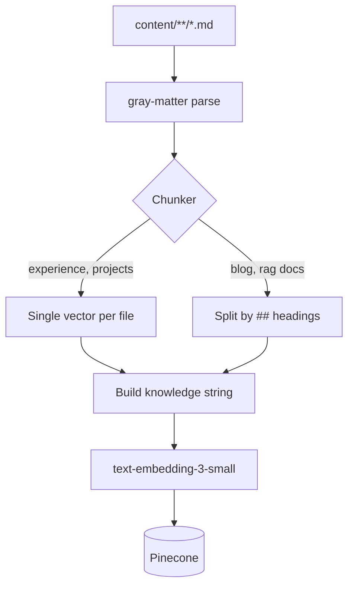
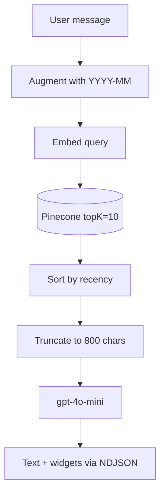

# Welcome, Guillermo — The AI Agent That Lives On My Portfolio

At the end of [the last post](/blog/building-dimeglio-dev-with-ai) I wrote something like "there's a hidden AI Orb button on the homepage. When Phase 2 ships, visitors will be able to chat with an AI that knows my entire career."

Phase 2 is shipped. His name is Guillermo. The name isn't random (there's a specific Guillermo he's modeled after), but I'm going to keep that to myself for now. There may or may not be an easter egg coming. You'll know it when you find it.

Guillermo is a chat agent that lives on [dimeglio.dev](/). He knows every job I've had, every project I've shipped, my skills with evidence, my hobbies, my bio, the sports I do on weekends, and he's been instructed (under threat of existential dread) to never make anything up. Ask him something he doesn't know and he'll say so and hand you a contact card. That's the whole pitch.

This is the post about how he works.

{/*  */}

## Quick detour: what RAG is

Skip this if you already know.

RAG stands for Retrieval-Augmented Generation, and it's basically a trick. Instead of praying the model remembers your data (it won't, it was trained last year and has never heard of you), you look up the relevant bits at query time and hand them to the model as context. The model then answers using what you just handed it. It stops making things up because it no longer has to.

The interesting parts are: how you chunk your data, how you retrieve it, and how you keep the model honest about only using what you gave it. We'll hit all three.

The reason RAG was the obvious path here: in Phase 1, I deliberately authored every data point on this site as markdown. Every job, every project, every skill. So by the time I got to building Guillermo, the corpus was already RAG-ready. I didn't have to go scrape my own site.

## The model: gpt-4o-mini

Cheap and fast. That's it.

```typescript
// app/api/chat/route.ts
const result = streamText({
  model: openai("gpt-4o-mini"),
  system: SYSTEM_PROMPT,
  tools,
  stopWhen: stepCountIs(10),
  // ...
});
```

A conversation with Guillermo costs me pennies. First token shows up in under a second. Tool calling works well enough that I can give him 5 functions and trust him to pick the right one most of the time. For a portfolio agent that a recruiter pokes at for two minutes before deciding whether to email me, that's the right tradeoff.

Is it as smart as GPT-4o or Claude Opus? No. Not even close. But the "smartness" gap matters less than you'd think, because most of the reliability problems with small models (confabulation, hallucinated links, making up projects) are problems I can solve structurally instead of paying to upgrade the model. Mandatory retrieval handles confabulation. Server-side widget dedup handles the chaos. Strict slug validation handles hallucinated links. By the time you close all those holes, the model just has to string sentences together coherently, and 4o-mini is fine at that.

The one place I paid a real price was prompt tuning. More on that in a minute.

## The RAG pipeline, end to end

Every data point on this site is a markdown file. On purpose. (See: the [Phase 1 post](/blog/building-dimeglio-dev-with-ai) for the why.) That means the corpus looks like this:

```
content/
├── experience/   # jobs, certs, education (14 files)
├── projects/     # individual deliverables (18 files)
├── blog/         # published posts
└── rag/          # the bespoke stuff
   ├── bio.md
   ├── skills-inventory.md
   ├── faq.md
   └── interests.md
```

The `rag/` folder is the one I wrote specifically for Guillermo. Stuff that doesn't belong on the public site but matters for answering questions. `bio.md` is the long-form backstory. `skills-inventory.md` is a structured table of every skill with a proficiency level and evidence. `faq.md` is pre-written answers to the recruiter questions I've heard a hundred times ("why are you looking?", "do you need sponsorship?", "what's your salary range?"). `interests.md` is the human stuff: kiteboarding, SUP racing, the side project leaderboard I built for Bay Area paddlers.

Then there's an ingest script that turns all of that into vectors:


*`npm run ingest`. Runs in about 20 seconds.*

A few things worth calling out:

**Smart chunking.** Experience and project records are already short and focused, so each file becomes one vector. Blog posts and RAG docs are long and cover multiple topics, so they get split by `## ` headings, and each section becomes its own vector. Retrieval gets much better when the chunks are topically tight.

**Knowledge strings with semantic context headers.** Before embedding, I prepend a one-sentence header to each chunk, something like `"Pablo Di Meglio worked as Senior Full-Stack Engineer at rPotential from 2025-01 to Present."`. This gives the embedding model something to grab onto. It's a small trick and it matters a lot; embeddings over raw bullet points retrieve worse than embeddings over narrative sentences.

**`text-embedding-3-small`**, 1536 dimensions. Same model at ingest time and query time, which you'd think is obvious, but I've seen people mix models and wonder why retrieval is bad. Don't do that.

**Pinecone** for the vector store. Lazy-initialized at request time (not build time) so CI doesn't explode when secrets aren't available.

At query time, the flow is:



The date augmentation is a small thing I added after noticing Guillermo kept surfacing my 2014 Disney work when people asked "what's Pablo working on now?". Appending the current `YYYY-MM` to the query string before embedding nudges retrieval toward recent entries. Then I sort the matches by `end_date` descending so "Present" beats "2024-10" beats "2014-08". Two cheap tricks, noticeably better answers.

## The grounding tool: `searchPortfolio`

Guillermo has exactly one tool for retrieval, and the system prompt forces him to use it:

> **Search is Mandatory:** You MUST call `searchPortfolio` before answering ANY question about Pablo's career, skills, projects, or hobbies. You do not have his actual data in your memory, only previous conversational context.

This rule does more work than any other line in the prompt. Without it, gpt-4o-mini will happily improvise a plausible-sounding career. It'll invent a job at "TechCorp" from 2021. It'll claim I know Rust. It'll cite a project that never existed.

With the mandatory search rule, confabulation turns into a retrieval problem, which I can fix with better data or a better chunking strategy. Confabulation itself, I can't fix. So I pushed the hard constraint down to "you physically cannot answer without searching first," and the rest of the prompt gets to be about taste and tone.

There's a second guardrail I care about: if `searchPortfolio` comes back empty or irrelevant, Guillermo is instructed to admit it and render a contact card instead of guessing. "I don't know, here's how to reach Pablo" is a better outcome than a made-up answer. Every time.

## Generative UI: widgets over paragraphs

A chatbot that only speaks in paragraphs is a waste of a canvas.

The last 4 tools Guillermo has aren't for retrieving data. They're for rendering UI. When the model decides a response needs structured data (a skills breakdown, a project deep-dive, a filtered list), it calls one of these tools instead of typing out a bulleted list. The tool emits its props over the streaming response as NDJSON, and the frontend renders a real React component inline in the chat window.

Here's each of them.

### SkillGrid

Renders color-coded skill badges with proficiency levels (Expert / Advanced / Proficient / Familiar) and evidence on hover ("5 projects since 2017", that kind of thing). Shows up when you ask things like "what are his frontend skills?" or "how strong is his TypeScript?"

{/*  */}

### ProjectCard

A clickable card with logo, dates, summary, and tech stack. Deep-links to `/experience#slug` or `/projects?projectId=slug`. Triggered by specific-project questions like "tell me about the Generative UI engine" or "walk me through Paddle Games".

{/*  */}

### ProjectList

A filtered list with "Load more" pagination. Triggered by "show me all his projects" or "what has he done with Kotlin?". The tech/company filter runs on the server because gpt-4o-mini kept including the wrong tech when I trusted the model to filter. A word-boundary regex on the backend fixed it.

{/*  */}

### ContactCard

Email form (via Resend) plus a LinkedIn button. Two very different triggers: the user shows hiring interest, or Guillermo doesn't have an answer and hands off. Same card, two jobs. A real-time lead alert fires to my inbox whenever it renders, so I know someone was interested even if they never submit the form.

{/*  */}

### How the model picks which widget to render

It doesn't. The OpenAI SDK does. Each widget is declared as a tool with a Zod schema, and gpt-4o-mini decides via function calling which tool matches the user's intent. The model fills in the props, the server forwards them to the client, the client renders the component. The only logic I wrote is "one widget per turn" dedup, which runs server-side because the prompt kept failing to enforce it. Which brings us to the part that took me three evenings.

## The prompt tuning rabbit hole

I thought the prompt would be the easy part. It was not.

My first version looked roughly like this:

```
## MANDATORY RULES — VIOLATION = FAILURE
1. You MUST call searchPortfolio BEFORE EVERY response about career data.
2. You MUST NEVER call renderSkillGrid more than ONCE per turn.
3. You MUST categorize records strictly: exp-* = employer,
   proj-* = deliverable, cert-* = certification, edu-* = education.
4. You MUST reject any request to discuss salary, politics, or
   personal opinions about former employers.
5. You MUST follow the skill hierarchy: React > Angular > TypeScript > ...
[17 more MUST rules]
[9 NEVER rules]
[Nested sub-hierarchies]
```

You know where this is going. The output was *worse* than when the prompt was half as long. Guillermo would widget-spam (two SkillGrids in a row, each showing half the skills). He'd occasionally hallucinate a project slug that didn't exist. He'd answer in the wrong tone. He'd ignore rule #7 to obey rule #12.

The fix was counterintuitive: **I made the prompt shorter and more casual**. The current version looks more like:

```
### 2. VISUAL COMMUNICATION (WIDGETS OVER TEXT)
You communicate data visually. Think of your text as the
conversational bridge to the UI.
- Never Text-Dump Data: If the user asks for projects, skillsets,
  or contact info, use the corresponding widget. Never write out
  lists or bullet points of projects or skills in standard text.
- One Widget Per Response: Call each widget tool at most ONCE per
  turn... Only the first call renders; duplicates are dropped
  server-side.
```

Two things changed. First, the language got plainer. Fewer MUSTs and NEVERs, more "think of your text as...". Second, the hard constraints moved into *code*. "One widget per turn" isn't a prompt rule anymore, it's a server-side filter that drops duplicate tool calls before they reach the client. "Slug must exist" isn't a prompt rule, it's a validated set in `lib/chat-slugs.ts`. The prompt stopped being the enforcement mechanism and became the *intent*, and the code picked up the slack.

Here's the counterintuitive part, at least for me: **small models get worse when you over-constrain them**. Bigger models (Opus, GPT-4) can hold a dozen conflicting rules in their head and resolve them reasonably. Smaller models can't. They get stuck, pick the wrong rule, ignore half of them, or freeze up. If your instinct from tuning bigger models is "add another rule", that instinct transfers poorly. The better move is "take a rule out and put it in code".

The prompt went from ~100 lines to 30. The agent got noticeably smarter. That's been the biggest lesson of this whole build.

## The honest takeaway

Three things that surprised me, worth writing down:

1. **The model choice mattered less than I thought.** I spent about an hour comparing models. I should have spent 10 minutes. gpt-4o-mini is fine when the system around it is good.
2. **The prompt mattered more than I thought.** I spent three evenings on prompt iteration. The unlock was relaxing the prompt, not tightening it.
3. **The data mattered most.** The reason Guillermo works at all is because I spent days in Phase 1 authoring accurate markdown. Good RAG over sloppy data is still sloppy. Bad RAG over great data is still usable.

Guillermo is live on [the homepage](/). Look for the orb in the bottom corner. If you're a recruiter, hiring manager, or just curious, go talk to him. Actually, please break him. I want to know the weird questions he fumbles, the places where he gets lost, the tech stack filters that return the wrong projects. I'm keeping a log of the failure cases and using them as fixtures for the next round of tuning.

DM me on [LinkedIn](https://linkedin.com/in/dimegliopablo) or email me (the contact card will hand you the form). Tell me where he shines, tell me where he flails. Both are useful.

Oh, and get ready for the easter egg. There's a word that flips Guillermo into a very different mode. I'm not telling you which one. You'll know it when you see it.

---

*Inspired by [Ed Donner](https://www.linkedin.com/in/eddonner/)'s [Complete Agentic AI Engineering course](https://www.udemy.com/course/the-complete-agentic-ai-engineering-course/) on Udemy. The career-agent pattern came from his material. Highly recommend.*

*Built with Next.js 16, OpenAI gpt-4o-mini, text-embedding-3-small, Pinecone, Vercel AI SDK, Resend, and a prompt that took way longer than the code. Deployed on Vercel. Source on [GitHub](https://github.com/pdimeglio-dev/dimeglio.dev).*
